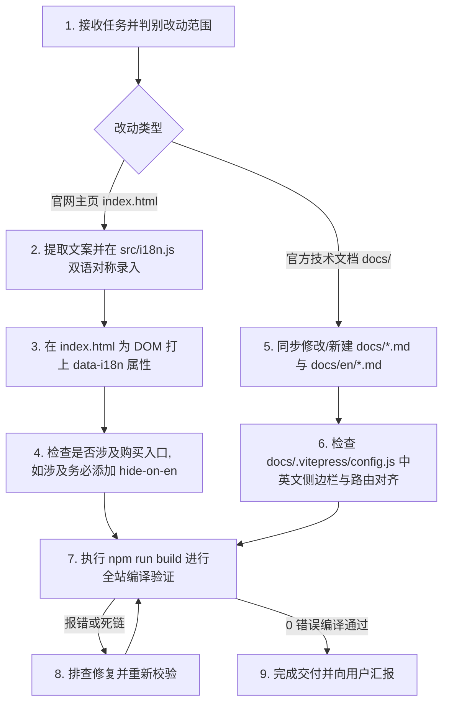

# AGENTS.md - 官方网站与技术文档站 AI 维护规范

> **目标受众**：面向所有参与本子项目（`official-website/`）维护的 AI Agent（包括 Antigravity, Claude, Codex, Cursor 等）以及全栈开发工程师。  
> **核心定位**：本子项目为穿云投屏 / ScrcpyOverWebRTC 的对外官方站点，集成了 **官网主页 (Vite)**、**全量技术文档站 (VitePress 双语)** 以及 **Demo 管理控制台 (Demo WebApp 融合产物)**。  
> **生效范围**：任何涉及本目录内代码、文档、配置、样式的修改与迭代，**必须无条件严格遵守本规范**。

---

## 🛡️ 一、 绝不可逾越的核心红线 (CRITICAL GUARDRAILS)

### 🔴 规则 1：英文名称必须且只能使用 `ScrcpyOverWebRTC` (Mandatory English Brand)
本项目在国内对外的中文产品名称为 **“穿云投屏”**，在国际开源社区与英文环境下，产品名称统一规范为 **`ScrcpyOverWebRTC`**。
- ❌ **严禁行为**：
  - 严禁将产品名称直译为 `Chuanyun Mirror`、`CloudPhone Screen Mirror`、`Through Cloud Mirror` 等非标准拼写；
  - 严禁在英文主页标题、Hero 区域、导航栏 Logo、页脚 Logo、英文文档正文中遗留未翻译的“穿云投屏”中文或拼音。
- ✅ **唯一正确做法**：
  - 英文主页 Logo 与 Hero 标题统一显示为 **`ScrcpyOverWebRTC`**；
  - 英文主页页脚统一为 **`ScrcpyOverWebRTC Project`**；
  - 英文文档站标题与描述统一采用 `ScrcpyOverWebRTC Docs`。

---

### 🔴 规则 2：英文模式下必须彻底隐藏“授权购买”所有入口 (Hide Pricing in English)
目前商业化授权购买仅面向国内市场，**英文环境下严禁暴露任何“购买授权”、“授权购买”或价格相关入口**。
- ❌ **严禁行为**：
  - 严禁在英文模式下展示 `/buy.html` 链接、购买按钮或价格方案；
  - 严禁在英文技术文档导航栏与侧边栏中加入购买或商业授权外链。
- ✅ **实现与双重保障规范**：
  - 主页中所有与授权购买相关的元素（导航链接、顶部购买按钮、Hero 操作区按钮、页脚链接等）必须添加样式类 **`class="hide-on-en"`**；
  - 采用 **CSS 级联样式强行隐藏**：
    ```css
    html[lang="en-US"] .hide-on-en,
    body.lang-en .hide-on-en {
      display: none !important;
    }
    ```
  - 采用 **JS 逻辑显隐联动**：在 [`src/i18n.js`](./src/i18n.js) 的 `setLocale(lang)` 中即时遍历 `.hide-on-en`，确保切换语言时 100% 隐藏无闪烁。

---

### 🔴 规则 3：主页严格双语绑定，严禁裸露硬编码中文 (Zero Hardcoded Chinese in index.html)
官网主页 [`index.html`](./index.html) 采用无框架的高性能原生响应式架构，所有界面文案均已接入国际化系统。
- ❌ **严禁行为**：
  - 严禁在 `index.html` 中直接新增或修改无 `data-i18n` 属性的裸中文标签；
  - 严禁只在 [`src/i18n.js`](./src/i18n.js) 的 `zh-CN` 字典中增加词条而遗漏 `en-US` 字典（两边必须 100% 键名对称）。
- ✅ **国际化绑定规范**：
  - 文本内容替换：标签添加 `data-i18n="yourKey"`；
  - 属性替换：标签添加 `data-i18n-attr="title:yourKey,placeholder:yourKey"`；
  - 每次新增词条必须同步在 [`src/i18n.js`](./src/i18n.js) 中的 `TRANSLATIONS['zh-CN']` 和 `TRANSLATIONS['en-US']` 两处同时录入。

---

### 🔴 规则 4：技术文档 1:1 双语严格对称对齐 (1:1 Symmetrical Documentation)
技术文档由 VitePress 驱动，构建目标包含中文根站与 `/en/` 英文子站。
- ❌ **严禁行为**：
  - 严禁“只写中文文档、不写英文文档”，导致英文站缺失或产生 404 死链；
  - 严禁中英文目录结构错位、文件名不一致。
- 🔒 **对称维护规范**：
  - **文档文件 1:1 映射**：中文文档位于 [`docs/*.md`](./docs/)，对应的英文文档必须同步创建或修改于 [`docs/en/*.md`](./docs/en/) 下的同名文件（例如 `docs/faq.md` 对应 `docs/en/faq.md`）；
  - **VitePress 路由同步**：修改文档层级或新增文档时，必须同时在 [`docs/.vitepress/config.js`](./docs/.vitepress/config.js) 的 `locales.root`（中文）与 `locales.en`（英文）中同步配置导航与侧边栏。

---

### 🔴 规则 5：严禁直接修改外部开源镜像仓库 `ScrcpyOverWebRTC/`
- 项目根目录下的 `ScrcpyOverWebRTC/` 为 GitHub 独立开源镜像同步目录；
- ❌ **严禁行为**：严禁在 `ScrcpyOverWebRTC/` 目录下做任何手动代码修改或提交；
- ✅ **唯一修改源**：官方网站与对外文档的所有维护，必须且只能在本项目当前目录（`official-website/`）中进行。

---

### 🔴 规则 6：每次提交前必须执行全站自动化编译构建 (Build & Verify Gate)
官方网站通过自动化合并脚本将 Vite 官网产物、VitePress 文档静态 HTML 以及 Demo WebApp 合并至 `dist/` 目录。
- 🔒 **强制验证门禁**：
  每次完成修改后，**必须在 `official-website/` 根目录下执行**：
  ```bash
  npm run build
  ```
  该命令会依次执行：
  1. `vite build`：构建主站 HTML/CSS/JS；
  2. `vitepress build docs`：构建全量 64+ 篇中英文技术文档；
  3. `node scripts/build-merge.js`：调度并合并 Demo 管理控制台与文档资源。
  **必须确保退出码为 0 且无任何编译报错！**

---

## 🛠️ 二、 AI Agent 标准操作流程 (Standard Operating Procedure)

当接到关于官网与文档站的开发、文档编写、翻译或优化需求时，AI Agent 必须严格按照以下流程进行：



---

## 📂 三、 核心文件拓扑与职责速查 (Quick Reference)

| 文件 / 目录路径 | 职责与维护规范 |
| :--- | :--- |
| [`index.html`](./index.html) | 官网单页入口，严格遵守无硬编码中文，属性绑定 `data-i18n`，购买入口标记 `.hide-on-en`。 |
| [`src/i18n.js`](./src/i18n.js) | 核心国际化引擎与字典，包含 `zh-CN` 与 `en-US` 字典，控制语言切换、英文隐藏类切换与文档路径映射。 |
| [`src/style.css`](./src/style.css) | 官网全局样式表，包含 `.hide-on-en` 强行隐藏规则以及弹性响应式布局。 |
| [`src/main.js`](./src/main.js) | 主页交互逻辑（动效拓扑画板、延迟仿真、一键复制、动态配置加载）。 |
| [`docs/*.md`](./docs/) | 官方技术文档**中文版**（共 32 篇，涵盖架构、接入、部署、功能、实操、开发与排障）。 |
| [`docs/en/*.md`](./docs/en/) | 官方技术文档**英文版**（必须与中文版保持 1:1 文件名与章节对称）。 |
| [`docs/.vitepress/config.js`](./docs/.vitepress/config.js) | VitePress 配置文件，统一维护双语的导航栏、7 大侧边栏与全文搜索配置。 |
| [`scripts/build-merge.js`](./scripts/build-merge.js) | 全站打包合并脚本，负责调度 Demo 构建并统一落盘至 `dist/`。 |
| [`package.json`](./package.json) | 工程配置与构建命令（`npm run build`, `npm run dev`, `npm run docs:dev`）。 |
