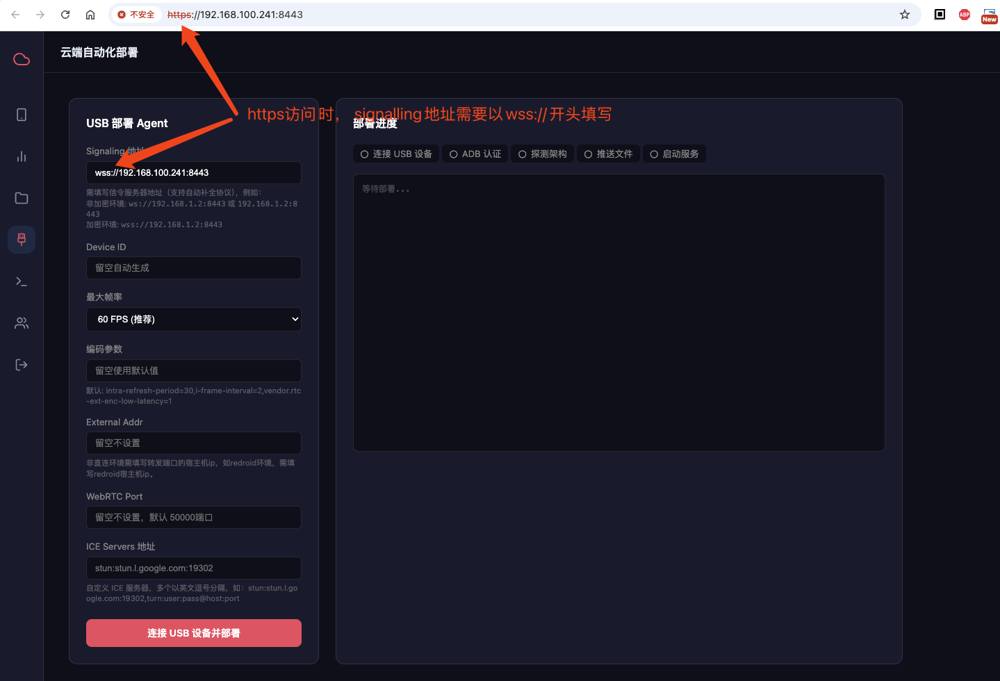
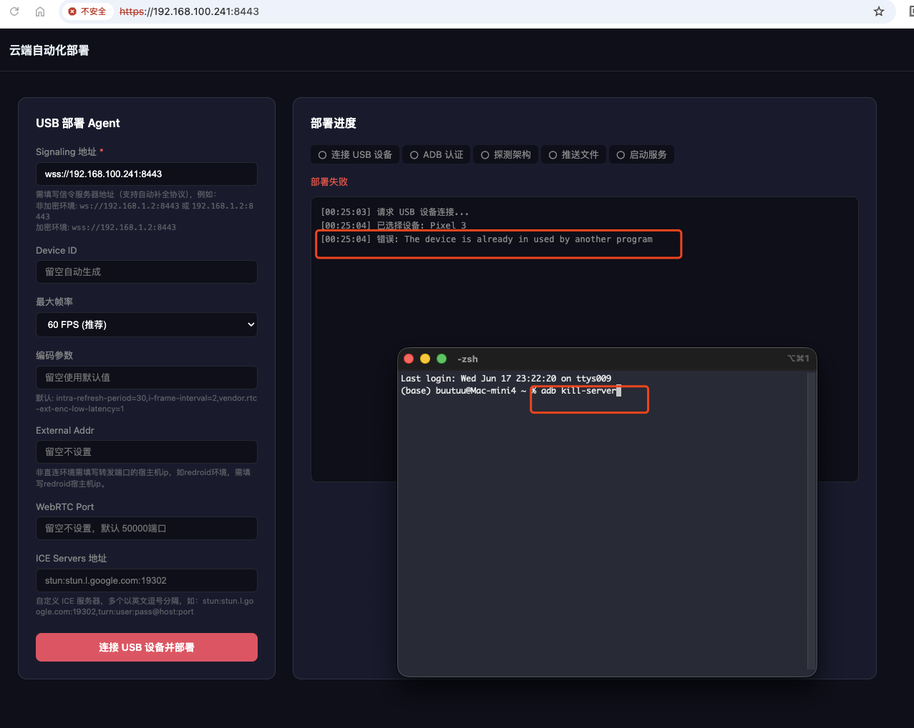

# 通过网页（WebUSB）一键部署设备

本章节介绍如何使用 PC 网页端提供的 **“网页一键部署（WebUSB / WebADB）”** 功能来添加并激活您的云手机设备。

这是一种免驱动、零门槛的直连接入方式。只要使用物理数据线将 Android 手机连入您浏览网页的 PC 电脑上，点击网页按钮，系统便能完全通过浏览器底部的 WebUSB 通道将控制代理推送并拉起。**您无需在本地电脑上下载或安装任何 ADB 工具链。**

---

## 🔐 1. 核心安全须知：安全上下文与 HTTPS 限制

由于 WebUSB 和 WebADB 技术允许网页直接和您的物理 USB 设备进行指令通信，为防范恶意网站静默越权操控 USB 硬件，**现代浏览器（Chromium 引擎）实施了极其严格的安全上下文（Secure Context）限制**：

### A. 在本地 HTTP 访问时
* 仅允许通过 **`http://localhost:8443`** 或 **`http://127.0.0.1:8443`** 进行访问。
* 在本地环回（Local Loopback）上下文中，浏览器会放行 WebUSB 权限，您可以正常进行一键部署。

### B. 在局域网 IP / 公网访问时
* **如果使用普通 HTTP 协议**（例如通过局域网访问 `http://192.168.1.100:8443`）：浏览器为了安全防范，**会直接在底层锁死并隐藏 WebUSB 相关的 API**。这会导致网页上的“一键部署”或“选择设备”按钮无法工作或提示 API 不存在。
* **如果使用安全 HTTPS 协议**（例如访问 `https://192.168.1.100:8443` 或绑定了证书的域名）：浏览器会判定为安全环境，正常唤起 WebUSB 弹窗。

> [!CAUTION]
> **重要警告**：如果您没有配置 SSL 安全证书，且通过非本机的局域网 IP 跨电脑访问网页，您将**无法**使用网页一键部署功能。此时请务必按照 [依赖安装与服务编译指南](/deps-and-build) 部署 SSL 证书开启 HTTPS，或者退回使用 [通过 ADB 命令行部署](/agent-add-adb) 方式。

---

## 🔌 2. 物理连接限制

* **必须使用物理 USB 数据线**：当前网页一键部署引擎通过底层的 WebUSB 协议栈（直接与物理 USB 控制器通信）实现，**当前不支持无线 ADB（ADB over Wi-Fi）模式的网页推送**。
* **数据线校验**：请确保使用支持数据传输的 USB 优质线缆（部分廉价的充电专用线没有数据屏蔽层或数据脚线，会导致设备无法被浏览器识别）。
* **浏览器要求**：必须使用支持 WebUSB 标准的 Chromium 内核浏览器（如 Google Chrome, Microsoft Edge, Opera, Brave 等）。*Firefox 和 Apple Safari 浏览器不支持 WebUSB。*

---

## 🚀 3. 网页一键部署步骤

请按照以下流程在网页中完成一键添加：

### 第一步：连入物理设备
1. 在手机的“开发者选项”中开启 **“USB 调试”**（部分系统需开启“USB 调试（安全设置）”）。
2. 将手机通过 USB 数据线连接到您的控制端 PC 上。
3. 确保您已经通过安全的地址（本机 `http://localhost:8443` 或配置了 HTTPS 的 `https://<IP>:8443`）打开了控制后台网页。

---

### 第二步：唤起设备选择弹窗
1. 进入管理后台主页，点击左侧菜单或设备卡片上的 **“部署新设备”** 按钮。
2. 此时，浏览器地址栏下方会滑出系统的 USB 硬件选择窗口，其中会列出您通过 USB 连接的 Android 手机物理名称。

<!-- TODO: 待补充步骤一截图 -->
<!--  -->

---

### 第三步：配对并授权连接
1. 在弹出的设备列表中点击选择您的手机型号（如 `Pixel 6` 或 `Redmi Note`）。
2. 点击 **“连接 (Connect)”** 按钮。
3. 观察您的手机屏幕，此时手机上会弹出 ADB 调试密钥授权对话框，请勾选 **“始终允许这台电脑进行调试”**，并点击 **“确定 / 允许”**。

<!-- TODO: 待补充步骤二截图 -->
<!--  -->

---

### 第四步：输入参数一键推送
1. 在网页端的配置表单中，输入您为设备拟定的唯一 **设备 ID**（如 `phone-02`）以及服务端的信令地址。
   
   * > [!WARNING]
     > **协议强制对应规则（防范 Mixed Content 阻断）**：
     > * 当您以 **HTTPS** 访问网页时，信令服务器地址**必须填入 `wss://` 前缀**（如 `wss://<IP>:8443`）。
     > * 当您以 **HTTP**（如本地 localhost）访问网页时，信令服务器地址**必须填入 `ws://` 前缀**（如 `ws://127.0.0.1:8443`）。
     > * *如果填错（如在 HTTPS 网页内填写了 `ws://`），浏览器将触发“混合内容安全审查”并直接阻断通信，导致部署失败。*
2. 配置投屏分辨率、帧率与码率限制（通常保持默认即可）。
3. 点击 **“一键部署”** 按钮：
   * 网页端将通过 WebADB 自动读取手机的 CPU 处理器架构。
   * 自动从信令服务器按需拉取对应版本的 `cloudphone-agent` 二进制包与 `libsys_core.so`。
   * 完成文件推送、权限赋予并在 Android 后台以 `setsid nohup` 静默拉起服务。
4. 部署成功后，配置卡片将展示“部署成功”，列表中会自动刷新出该设备，数秒内视频流将自动接通。

<!-- TODO: 待补充步骤三截图 -->
<!--  -->

---

## 🛠️ 4. 常见排障方法

### 1) 一键部署卡在 “正在获取架构 (Getting Arch)...” 进度？
* 这通常说明网页虽然与手机建立了 USB 物理连接，但手机端**未授予 USB 调试授权**。请解锁手机屏幕，在弹出的系统对话框中勾选并允许调试。

### 2) 报错提示：“The device is already in used by another program” (设备已被另一个程序占用)

* **原因解析**：WebUSB 允许浏览器直接与物理 USB 设备接口进行端到端通信，这要求当前 USB 设备控制权没有被系统其他进程占用。如果您电脑的后台启动了 `adb` 进程（如运行了 Android Studio、本地命令行 adb 或者其他手机助手投屏软件），电脑端的 `adb server` 守护程序会强行独占手机的 USB 接口。当浏览器尝试通过 WebUSB 声明（claim）该接口时，就会被操作系统内核拒绝并抛出此错误。
* **解决方案**：
  1. 在您的控制端 PC 上打开控制台（CMD/PowerShell/Terminal）。
  2. 执行以下指令，强制杀掉本地电脑的 ADB 守护服务以释放 USB 控制权：
     ```bash
     adb kill-server
     ```
  3. 杀掉后，刷新网页并重新在网页上点击“选择并连接设备”即可成功。

<!-- TODO: 待补充设备占用错误截图 -->
<!--  -->
