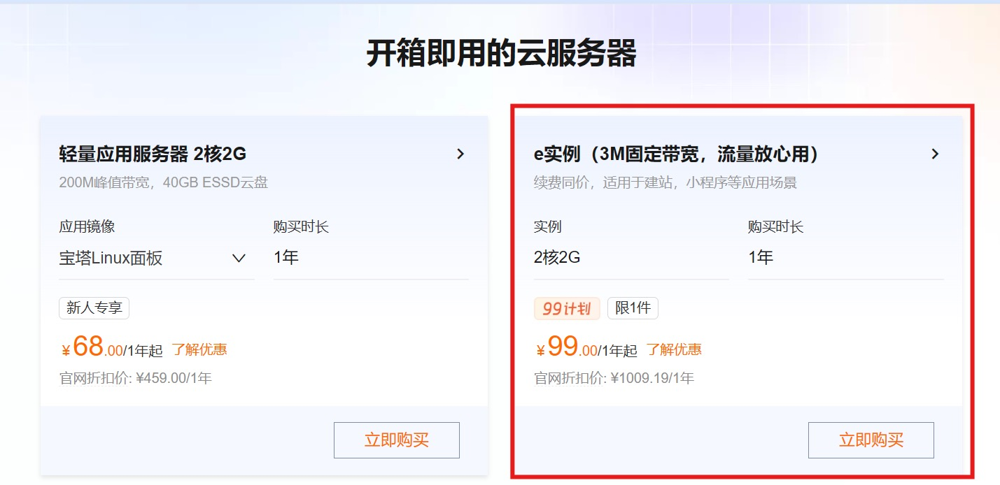
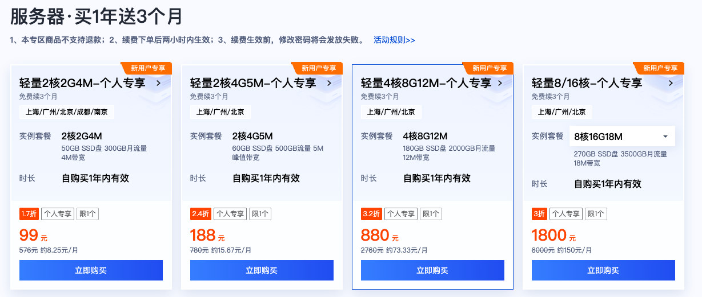

# 公网云服务器部署与穿透指南 (Cloud Deployment)

本指南介绍如何在阿里云、腾讯云、华为云、AWS 等公网云服务器（VPS）上部署 ScrcpyOverWebRTC。  
在公网环境下，系统支持通过 **IPv6 零成本直连** 与 **内置 coturn TURN 中转** 双轨机制，保障跨公网、复杂 NAT 下的音视频出流与控制。

---

## 💻 云服务器硬件配置推荐与选购

| 业务规模 | 推荐规格 | 纳管能力与并发说明 |
| :--- | :--- | :--- |
| **入门极客 / 中小型纳管** | **2 核 CPU / 2GB 内存 / 3Mbps 固定带宽** (阿里云特惠) | 可纳管 **100 台设备** (快照周期设为 30s)；同时支持 **2~4 人并发控制** (需调低码率至 0.2~0.5Mbps) |
| **多员工并发 / 小微工作室** | 4 核 CPU / 4GB 内存 / 10Mbps~20Mbps 带宽 (腾讯云特惠) | 支持 5~10 人同时在线高清操控，群控与批量分发性能更优 |
| **中大规模商用集群** | 8 核+ / 8GB+ / 独立中继节点 | 支持多机房集群化部署，外置多个独立 coturn 中继分流媒体数据 |

### 推荐服务器实测配置与容量参考：

以性价比极高的 **阿里云 2c2g3Mb (固定宽带)** 为例，实测容量与承载表现如下：
- 1. **纳管 100 台设备大盘巡检**：未连接直控时，设备仅需定时上报低频静态快照（快照上报频率可设置为 **30 秒** 或更长），整体占用云服务器带宽极低，轻松容纳 100 台机器挂载大盘。
- 2. **同时支持 2~4 人并发远程控制**：在跨公网且无法建立 P2P 直连（走服务器 TURN 转发）时，只需在网页端设置中将单设备码率调低至 **`0.2Mbps ~ 0.5Mbps`**（画质依然清晰可辨），3Mbps 带宽即可完美支撑 **2~4 人同时在线操作** 且不丢包不卡顿。
- 3. **局域网与 IPv6 访问零流量消耗**：若设备与控制端在局域网内或均具备 IPv6，WebRTC 会自动建立端到端直连，**完全不经过云服务器，不消耗公网服务器任何带宽**。
- 4. **业务增加与按需扩容**：若未来需要支持更多人同时高清操控，可随时升级云服务器带宽，或另购轻量服务器单独部署多个 TURN 中继节点分流。

* **阿里云特惠通道**：[https://www.aliyun.com/product/ecs?userCode=dgnlczx1](https://www.aliyun.com/product/ecs?userCode=dgnlczx1)  
  

* **需要更大带宽可选腾讯云特惠**：[https://curl.qcloud.com/2635ZOSn](https://curl.qcloud.com/2635ZOSn)  
  

---

## 🔐 1. 安全组与防火墙端口放行 (核心前置)

在云服务器厂商控制台（安全组 / 防火墙）中，必须放行以下端口：

| 端口号 | 协议 | 作用说明 |
| :--- | :--- | :--- |
| **`8443`** | `TCP` | Web 控制大盘访问与 WebSocket 信令通道端口 |
| **`3478`** | `TCP + UDP` | coturn STUN/TURN 中继监听端口 |
| **`50000-50100`** | `UDP` | TURN 媒体中转 UDP 端口段（AIO 镜像默认收窄范围） |

> [!WARNING]
> 如果安全组中封禁了 `50000-50100/UDP` 段，当客户端与手机处于严格对称 NAT 无法 P2P 直连时，TURN 媒体中继将受阻，导致“网页信令握手成功但画面一直黑屏”。

---

## 🐳 2. 方式一：Docker 一体化镜像部署 (AIO，推荐)

在云服务器（Linux）上，推荐直接使用 Host 模式启动。

> 💡 **国内云服务器极速拉取提示**：若直接从 Docker Hub 下载超时，可使用国内 DaoCloud 镜像站快速下载：  
> `docker pull m.daocloud.io/docker.io/buutuu/scrcpy-over-webrtc:latest && docker tag m.daocloud.io/docker.io/buutuu/scrcpy-over-webrtc:latest buutuu/scrcpy-over-webrtc:latest`

* **一键启动命令**：

```bash
docker run -d \
  --pull=always \
  --restart=always \
  --name cp-aio \
  --net=host \
  -v ./data:/app/data \
  -e PUBLIC_IP=<您的云服务器公网IP> \
  -e TURN_USER=my_secure_user \
  -e TURN_PASSWORD=my_secure_password \
  buutuu/scrcpy-over-webrtc:latest
```

- **`PUBLIC_IP`**：填写您云服务器的真实静态公网 IPv4 地址。
- **`TURN_USER` / `TURN_PASSWORD`**：生产环境请务必修改为自定义高强度凭据。

---

## ⚡ 3. IPv6 零成本公网直连机制

系统原生支持 IPv6 候选地址（ICE Candidate）的自动收集与协商：
- **零中转成本**：当手机（4G/5G 蜂窝网络原生支持 IPv6）与控制端均具备 IPv6 网络时，WebRTC 会自动建立端到端的公网 IPv6 P2P 直连。
- **直连优势**：数据包直接在手机与控制端之间传输，完全绕过云服务器的中转带宽，**公网流量费直接降为 0 元，且延迟更低**。

---

## 🛠️ 4. 方式二：Docker Compose 双容器分立部署

如果您从官方 [Releases](https://github.com/hqw700/ScrcpyOverWebRTC/releases) 下载了完整发布包，包内的 `docker/` 目录提供了将 `coturn` 与信令服务分立的 Compose 自动化部署脚本：

```bash
cd cloudphone-vX.Y.Z/docker
chmod +x deploy_cloud.sh
./deploy_cloud.sh deploy
```

该脚本会自动引导公网 IP 探测、生成高强度凭证并渲染配置文件启动集群。

### 常用运维指令：
- **查看运行日志**：`docker logs -f cloudphone-signaling`
- **一键回滚旧版本**：`./deploy_cloud.sh rollback`
- **彻底卸载服务**：`./deploy_cloud.sh uninstall`

---

## 🔑 5. 访问大盘与默认凭据

浏览器访问：`https://<您的云服务器公网IP>:8443`
- **默认管理员账号**：`admin`
- **默认初始密码**：`admin123`

*(首次登录后，请立即进入管理面板修改初始密码)*
