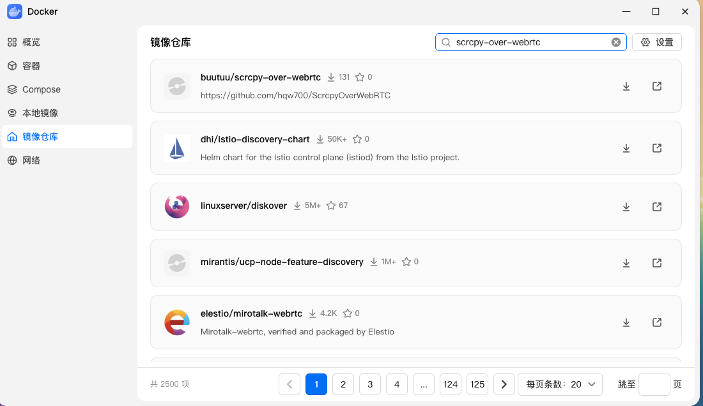
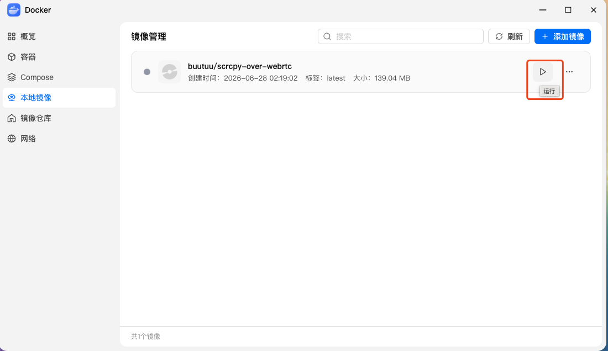
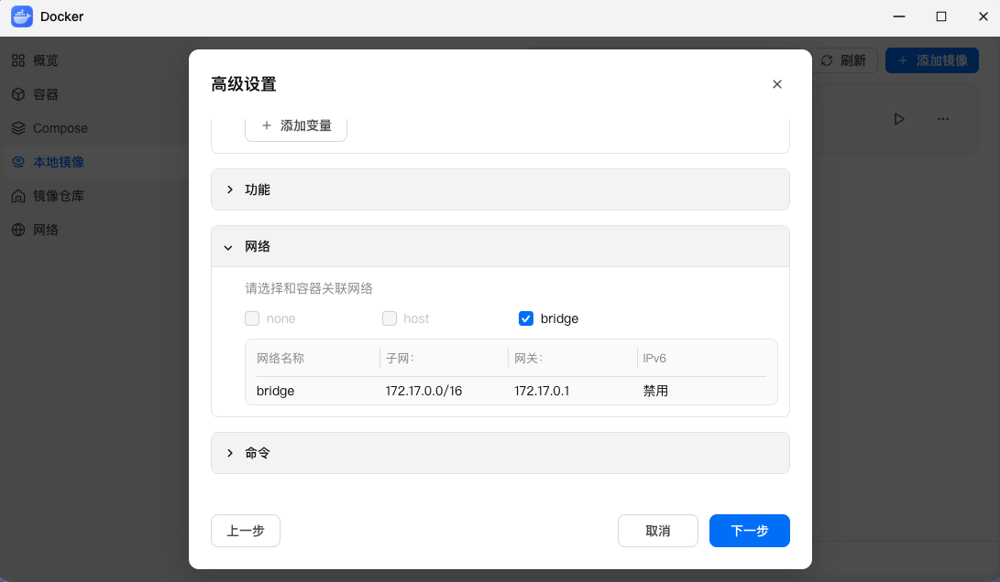
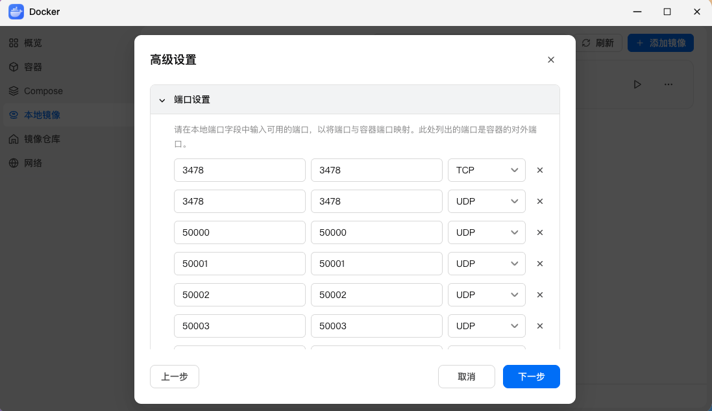
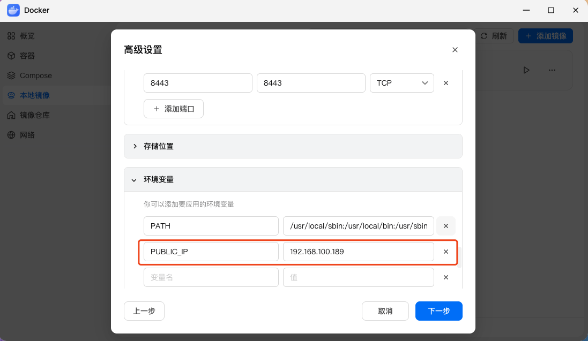
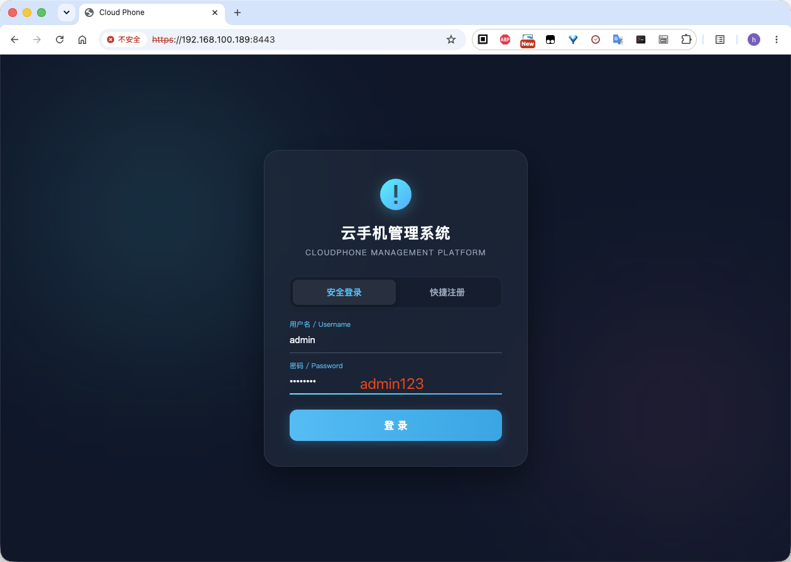
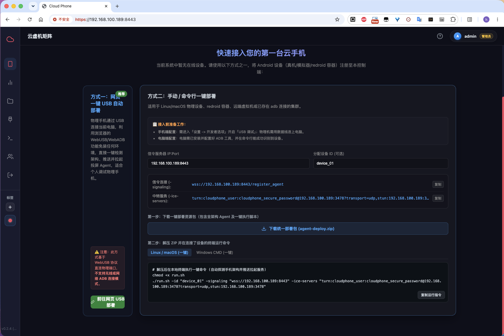

# 飞牛 OS (fnOS) NAS 部署指南

飞牛 OS (fnOS) 是一款深受喜爱的高性能 NAS 系统。其内置的图形化 Docker（容器）管理面板极其简单易用。
本指南介绍如何在飞牛 OS 的图形界面或 Compose 项目中，从 Docker Hub 拉取镜像，快速部署云手机信令与前端服务。

---

## 通过飞牛 OS 容器界面手动创建

如果您偏好在飞牛 OS 容器的图形界面上一步步点击配置，请参照以下交互配置流程：

### 1. 搜索并下载镜像
* 在飞牛 OS 「容器」应用中，点击左侧菜单的 **「镜像」**。
* 点击右上角 **「常用镜像」** 或直接在搜索框中输入：`buutuu/scrcpy-over-webrtc`。
* 在搜索结果中选中 `buutuu/scrcpy-over-webrtc`，版本选择 `latest`，点击下载。


### 2. 创建容器与基础配置
* 镜像下载完成后，在「镜像」列表中找到它，点击 **「启动」** 创建容器。
* **容器名称**：输入 `cp-aio`。
* **自启动**：勾选 **「容器退出时总是重启」** 选项。



### 3. 配置网络模式 (关键步骤)
* 点击配置页面的 **「网络」** 选项卡。
* **网络模式**：当前飞牛不支持选择HOST网络，但默认帮忙配置上了端口映射**。
  
  

### 4. 配置环境变量
* 点击配置页面的 **「环境」** (或「环境变量」) 选项卡。
* 点击 **「添加」** 按钮，增加以下两个关键变量：
  * **变量名**：`PUBLIC_IP` ➔ **值**：`<您的飞牛 NAS 局域网 IP>` (例如 `192.168.100.189`)。
  
  

### 5. 启动容器
* 其他配置（如卷/挂载、端口）默认留空即可。
* 点击 **「下一步」** 进行摘要审核，确认无误后点击 **「完成」**。

---

## 🔌 局域网入网与连接测试

服务启动后，您的云手机中心控制台就已在飞牛 NAS 内部健康运行：

1. **访问管理控制台**：
   在同局域网的电脑或手机浏览器中，打开：`https://<您的飞牛 NAS 局域网 IP>:8443`。
   * **默认管理员账号**：`admin`
   * **默认管理员密码**：`admin123`
   
2. **添加您的 Android 真机**：
   * 回到控制台主页，点击 **「部署新设备」**。
   * 按照网页一键 USB 部署指导，插上线配对入网；或者从部署页面下载一键部署包 `agent-deploy.zip`。
   * 解压一键部署包，并在电脑终端中运行命令，将设备注册地址指向您的飞牛 NAS 局域网 IP：
     ```bash
     # 以 Linux/macOS 电脑部署物理机为例
     ./run.sh -id my-phone -signaling wss://192.168.100.189:8443 -ice-servers "turn:cloudphone_user:cloudphone_secure_password@192.168.100.189:3478?transport=udp,stun:192.168.100.189:3478"
     ```
     
3. **开始流畅操控**：
   入网成功后，在飞牛 OS 托管的网页控制台点击设备画面，即可以极致低延迟的操作体验操控云手机。
