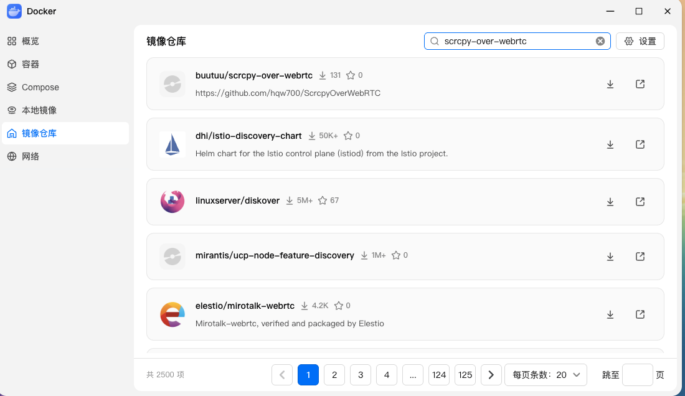
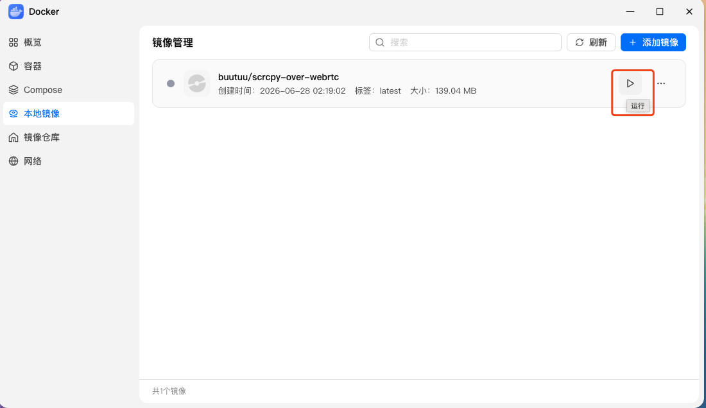
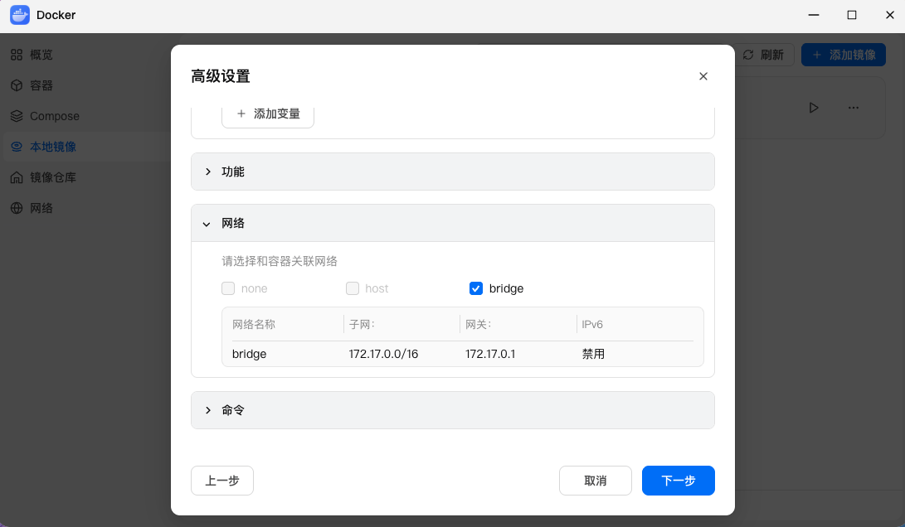
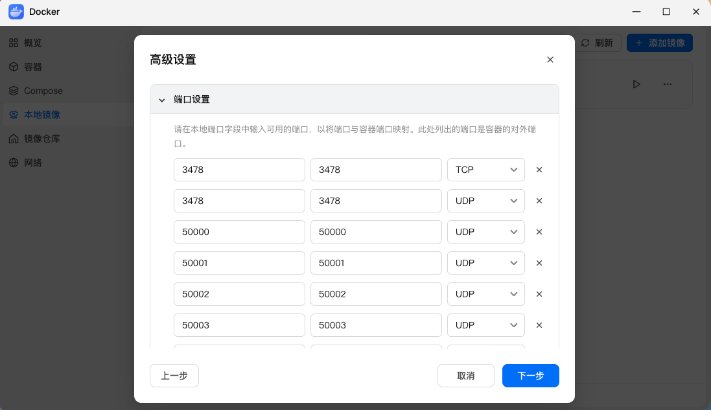
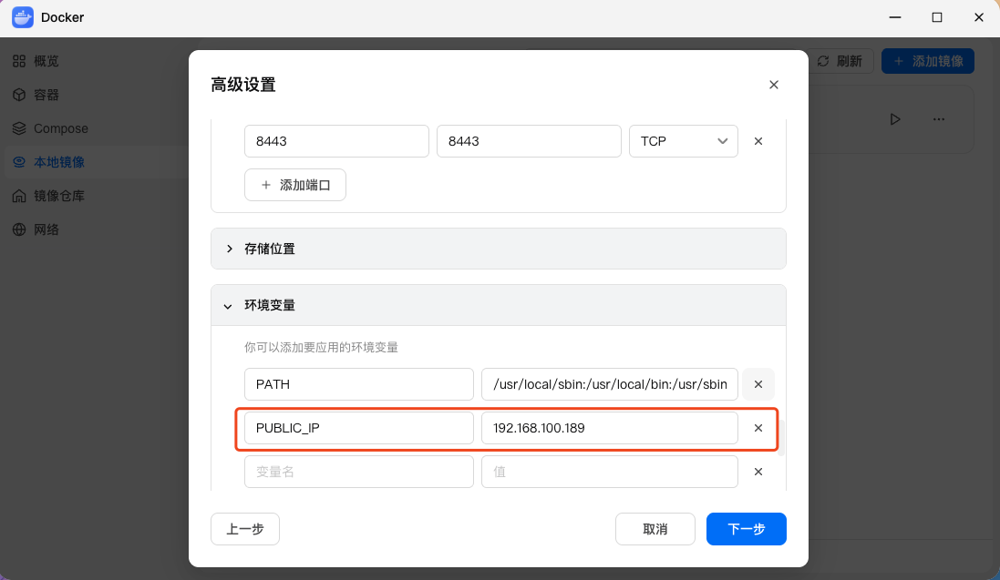
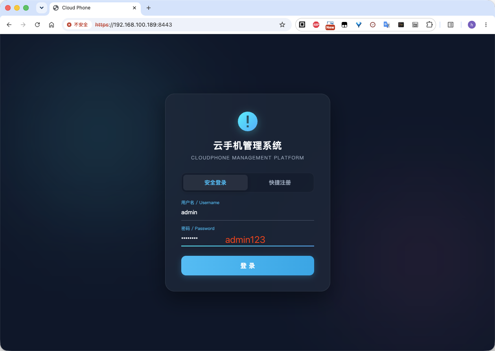
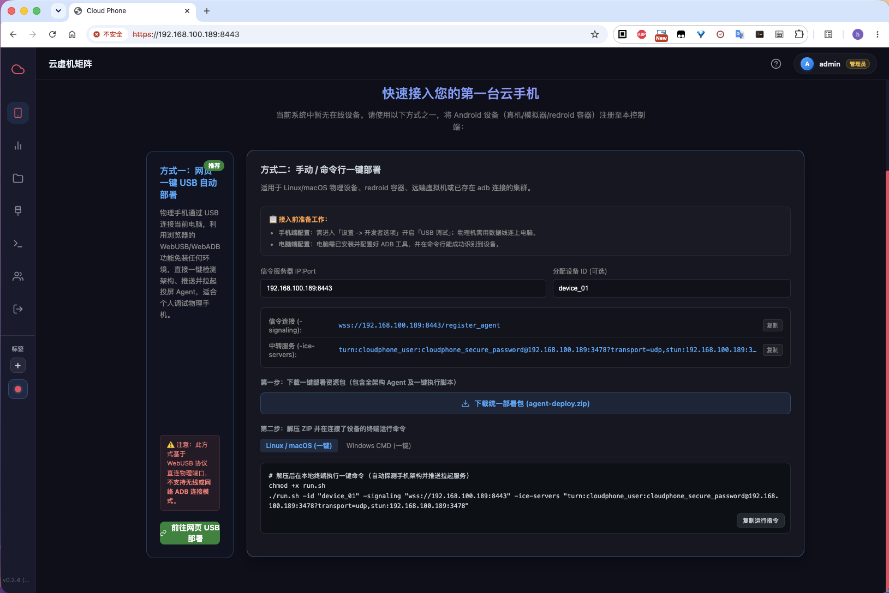

# NAS 与软路由部署指南 (fnOS / iStoreOS / Synology)

很多家庭与工作室用户拥有常开的 **私有云 NAS（如飞牛 fnOS、群晖 Synology）** 或 **软路由系统（如 iStoreOS / OpenWrt）**。  
在这些设备上通过 Docker 运行 ScrcpyOverWebRTC，能够打造 7x24 小时不间断运行的家庭或工作室私有云手机控制中心。

---

## 🐋 方案一：飞牛 OS (fnOS) 图形化部署

飞牛 OS (fnOS) 内置了体验极佳的图形化 Docker（容器）管理面板，支持开箱即用极速拉起。

### 1. 搜索并下载镜像
* 在飞牛 OS 「容器」应用中，点击左侧菜单的 **「镜像」**；
* 点击右上角 **「常用镜像」** 或直接在搜索框中输入：`buutuu/scrcpy-over-webrtc`；
* 选中并下载 `latest` 版本。
* *(💡 若网络搜索较慢或超时，可在 Docker 中配置国内镜像加速站 `"https://docker.m.daocloud.io"`，详见 [Docker 镜像加速配置](/deploy-docker#国内服务器--nas-极速加速配置强烈推荐))*



### 2. 创建容器与基础配置
* 镜像下载完成后，在「镜像」列表中找到它，点击 **「启动」** 创建容器；
* **容器名称**：输入 `cp-aio`；
* **自启动**：勾选 **「容器退出时总是重启」** 选项。



### 3. 配置网络与端口映射
* 点击配置页面的 **「网络」** 选项卡；
* 飞牛默认已自动识别并配置好端口映射（`8443` 信令、`3478` TURN 与 `50000-50100/UDP` 中转段）。




> [!TIP]
> 飞牛的默认端口映射已覆盖镜像声明的所有端口。如果您在映射时自定义了外部端口（非对称映射），请同步在环境变量中配置 `EXTERNAL_SIGNALING_PORT` 与 `EXTERNAL_TURN_PORT`，防止前端连错端口黑屏（详见 [服务端配置参考](/deploy-config)）。

### 4. 配置环境变量
* 切换到配置页面的 **「环境」** (环境变量) 选项卡；
* 点击 **「添加」** 按钮，增加以下关键变量：
  * **`PUBLIC_IP`** ➔ `<您的飞牛 NAS 局域网 IP>` (例如 `192.168.100.189`)；
  * **`TURN_USER` / `TURN_PASSWORD`** ➔ 自定义 TURN 凭据。



### 5. 配置存储挂载 (数据持久化)
* 在 **「存储」** (卷) 选项卡中，将 NAS 上的本地文件夹挂载到容器内部的 `/app/data` 路径；
* 用户账号、设备标签等数据将持久化保存，升级或重建容器不丢失。

### 6. 完成启动并验证
* 确认配置无误后点击 **「完成」** 启动容器。
* 在同局域网浏览器中打开 `https://<您的飞牛 NAS 局域网 IP>:8443`，默认账号 `admin` / `admin123` 即可进入管理大盘：




---

## 📶 方案二：iStoreOS / OpenWrt 软路由部署

由于软路由处于整个局域网的网关节点，直接在软路由中部署信令服务具有最高效的数据转发路径。

### 1. 推荐：SSH 终端一键运行 (Host 模式)
软路由系统强烈推荐使用 `--net host` 模式，直接共享软路由网口：

```bash
# 方式 A：官方 Docker Hub 源 (具备海外代理)
docker run -d \
  --name cp-aio \
  --restart always \
  --net host \
  -v ./data:/app/data \
  -e PUBLIC_IP=<软路由LAN口IP> \
  -e TURN_USER=my_user \
  -e TURN_PASSWORD=my_password \
  buutuu/scrcpy-over-webrtc:latest

# 方式 B：配置国内镜像加速站后拉取 (推荐)
# 在 /etc/docker/daemon.json 中配置 "registry-mirrors": ["https://docker.m.daocloud.io"] 并重启 docker
docker pull buutuu/scrcpy-over-webrtc:latest
```

### 2. 关键防坑：开放 OpenWrt 防火墙通信规则
若客户端与 Android 设备跨越了网段或从软路由 WAN 口接入，需放行防火墙：
1. 登录 iStoreOS 后台，进入 **「网络」➔「防火墙」➔「通信规则」**。
2. 添加一条新规则：
   - **名称**：`cloudphone-webrtc`
   - **协议**：`TCP+UDP`
   - **源区域**：`任意`
   - **目标区域**：`设备 (入站)`
   - **目标端口**：`8443, 3478, 50000-50100`
   - **动作**：`接受 (ACCEPT)`
3. 点击 **「保存并应用」**。

---

## 🖥️ 方案三：群晖 NAS (DSM 7.x Container Manager)

在群晖系统的 **Container Manager** 中：
1. 「注册表」中搜索 `buutuu/scrcpy-over-webrtc` 并下载；
2. 「映像」中选择启动容器，勾选 **「使用与 Docker Host 相同的网络」**；
3. 环境中添加 `PUBLIC_IP`（群晖局域网 IP）；
4. 存储空间设置中，添加文件夹映射到 `/app/data`；
5. 应用完成启动。

---

## 🔑 访问大盘与使用

启动成功后，浏览器打开 `https://<NAS或软路由IP>:8443`：
- **默认管理员账号**：`admin`
- **默认初始密码**：`admin123`

接入设备请参阅：[设备接入准备与部署](/agent-prep)。
