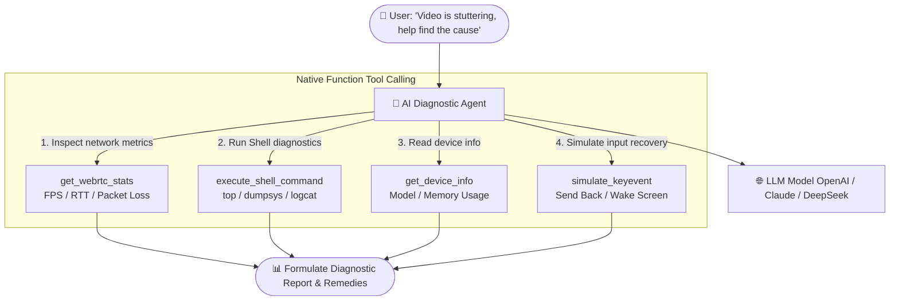

# AI Troubleshooting & Diagnostic Assistant

ScrcpyOverWebRTC embeds an **AI Troubleshooting & Diagnostic Assistant** directly within the web control console.  
Through natural language conversation, the assistant autonomously executes underlying ADB shell commands, inspects WebRTC streaming metrics, gathers hardware telemetry, and simulates input recovery events to diagnose black screens, stutter, packet loss, and app crashes.

---

## 🤖 Core Architecture & Tool Calling

### 1. Multi-LLM Compatibility
- Supports standard **OpenAI API formats** (`gpt-4o`, `gpt-4-turbo`);
- Supports **Anthropic Claude** and OpenAI-compatible models (such as **DeepSeek-V3 / DeepSeek-R1**, Qwen, etc.).

### 2. Reasoning Trace & Tool Execution Panel
- Features a collapsible **"AI Agent Reasoning & Tool Invocation Trace"** panel;
- Displays prompt parsing, step-by-step logic, dispatched tool parameters, and raw responses for complete transparency.

### 3. Native Diagnostic Tool Suite
- **`execute_shell_command`**: Runs low-level shell diagnostics on the device (e.g. `top -m 5`, `logcat -d *:E`) and summarizes outputs;
- **`get_webrtc_stats`**: Gathers real-time WebRTC metrics—FPS, RTT, packet loss rate, and Jitter Buffer depth—instantly pinpointing device vs. network bottlenecks;
- **`get_device_info`**: Reads device model, Android OS version, CPU architecture, and available RAM;
- **`simulate_keyevent` & `simulate_touch`**: Dispatches touch coordinates or system keys (Home, Back, Power) to perform automated recoveries.

---

## 🛠️ Configuration & Workflow

### Step 1: Configure LLM Provider
1. In the direct control drawer, open the **"AI Assistant"** tab;
2. Click **"AI Settings"** in the top-right corner;
3. Configure your endpoint:
   - **API Base URL**: e.g. `https://api.deepseek.com/v1` or `https://api.openai.com/v1`;
   - **API Key**: Your private API key;
   - **Model Name**: e.g. `deepseek-chat` or `gpt-4o`;
4. Click Save (keys are stored locally in your browser and never transmitted to third parties).

### Step 2: Natural Language Troubleshooting
Ask diagnostic questions directly in the chat interface:
- *"Inspect the top 3 processes consuming the most CPU on this device"*
- *"Stream feels sluggish, analyze current packet loss and round-trip time"*
- *"Find which app is currently in the foreground and fetch the last 10 lines of error logs"*

The assistant will formulate a tool plan, invoke the underlying diagnostics, and provide a clear remediation summary.
