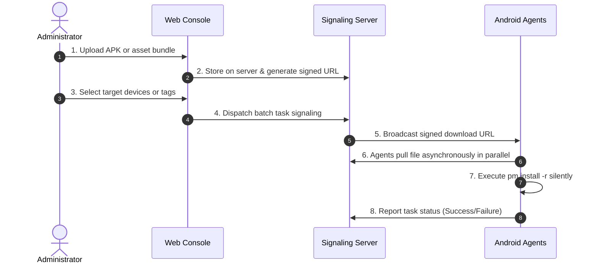

# P2P File Manager & Batch APK Distribution

ScrcpyOverWebRTC features a **peer-to-peer file manager** over WebRTC DataChannels and an **automated batch APK distribution system**, enabling high-speed file operations and silent app deployments without ADB or secondary FTP/SSH servers.

---

## 📁 1. P2P Web File Manager (`file-channel`)

### 1. Underlying Architecture & Flow Control
- **Dedicated Binary DataChannel**: Negotiates an isolated `file-channel` peer data stream during WebRTC setup, completely separated from video RTP packets and user input events;
- **Sliding-Window Congestion Control**: Chunks payloads with adaptive backpressure flow control; transferring files ranging from hundreds of megabytes to multiple gigabytes will not overwhelm memory buffers or cause video stutter;
- **Native Browser Interaction**: The frontend interfaces directly with the Android-side Agent daemon to read and modify the `/sdcard/` directory tree.

### 2. Capabilities & Workflow
Select the **"File Manager"** tab in the control console drawer:
- **Directory Navigation**: Traverse folder structures on the device;
- **File Manipulation**: Create new directories, rename files, and delete items;
- **Bidirectional Transfers**:
  - **Upload**: Click "Upload" or drag files directly from your desktop into the browser;
  - **Download**: Click the download icon next to any remote file to save it to your local computer;
  - **Drag-and-Drop APK Installation**: Drop any `.apk` package onto the streaming viewport or file manager; the Agent executes `pm install -r` silently in the background.

---

## 📦 2. Concurrent Batch APK Distribution

For fleet maintenance—such as updating apps or staging large assets across dozens of devices simultaneously:

### 1. Distribution Workflow

### 2. Core Advantages
- **Bandwidth Efficient**: The signaling server only broadcasts metadata and signed URLs;
- **Non-Blocking Silent Execution**: Each Agent downloads packages in an independent background goroutine and installs silently without interrupting active screen mirroring sessions.
