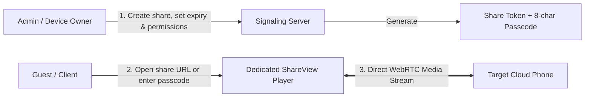

# Device Sharing & Access Passcodes

ScrcpyOverWebRTC supports sharing any cloud phone via **time-limited web links** or **8-character access passcodes (`CP-XXXX-XXXX`)**.  
External guests, clients, or team members can access and interact with target devices without registering or logging in, making it ideal for **remote support, customer demos, temporary leasing, and automated delivery**.

---

## 🔑 Core Architecture & Security Controls

1. **Dual Access Credentials**:
   - **Shareable URL**: Secured with a 16-byte cryptographically random token (e.g. `https://your-domain:8443/share/st_a1b2c3...`);
   - **8-Character Passcode**: Human-readable short code (e.g. `CP-8848-6688`), bidirectionally indexed with the token on the server.
2. **Granular Permission Policies**:
   - **Full Interactive Control (`full`)**: Guests enjoy touch interaction, hardware navigation keys, and bidirectional clipboard input;
   - **View-Only Mode (`view_only`)**: Enforced bidirectionally. The signaling server drops incoming touch and key events, and the player UI disables interactive controls, ensuring safe demonstrations.
3. **Optional PIN Security**:
   - Protect links with custom 4~16 digit PIN codes; visitors must authenticate with the PIN before streaming begins.
4. **Lifecycle & Automated Eviction (GC)**:
   - Configurable validity periods (30 minutes, 2 hours, 1 day, 7 days, or permanent);
   - Server background sweeps reclaim expired shares and **immediately disconnect active guest WebRTC sessions**; administrators can also revoke or renew passes anytime.
5. **Occupancy Overlay**:
   - When a guest is connected, the device card in the management console shows a translucent "🟢 In Use" badge, preventing conflicting operator actions.

---

## 🛠️ Step-by-Step Guide

### 1. Generate Share Link & Passcode
1. On the target device card or list row, open the menu (`···`) and select **"Share Device / Passcode"**.
2. Configure options:
   - **Access Rights**: Choose "Full Control" or "View Only";
   - **Expiry**: Select expiration timeframe;
   - **PIN Password**: Optional extra PIN requirement;
   - **Notes**: Memo for tracking customer or purpose.
3. Click **"Generate & Copy"** to copy the share link or passcode.

### 2. Guest Login-Free Access

Visitors can connect using any of the following methods:
- **Method A (Direct Link)**: Click the shareable URL directly in any web browser;
- **Method B (Web Portal Passcode)**: On the login page, click **"🔑 Passcode Direct Access"** and enter the 8-character code;
- **Method C (Android App Passcode)**: Open the Android app, tap **"Passcode Access"**, and enter the code.

### 3. Dedicated `ShareView` Player Experience
Guests are redirected to an isolated, lightweight player:
- Draggable floating navigation bar (Power, Home, Back, Recents, Volume);
- Independent stream quality selector (changes do not overwrite owner default settings);
- Top header with active connection status and countdown timer until expiration.
