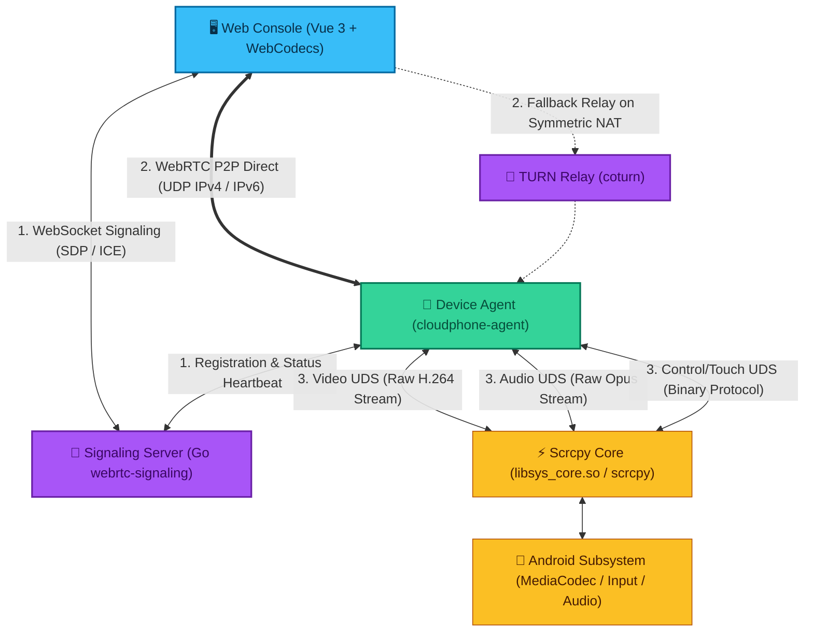

# Introduction & Architecture

ScrcpyOverWebRTC is an enterprise-grade **Web-based remote Android device management platform** optimized for ultra-low latency, real-time touch interaction, and large-scale device matrix operations.

By delegating media encoding and stream packetization directly inside the Android device, the system eliminates heavy centralized server transcoding, achieving a lightweight architecture with immediate responsiveness.

---

## 🎯 Core Design Principles

1. **Ultra-Low End-to-End Latency**: Through WebRTC UDP direct connection and hardware PTS passthrough, interactive delay ranges between **15ms ~ 40ms**, delivering native-feeling responsiveness.
2. **Zero Central Transcoding Overhead**: The signaling server only negotiates SDP and ICE candidates. Video and audio streams flow peer-to-peer between browser and Android without consuming server CPU/GPU transcoding cycles.
3. **Unified Multi-Form Management**: Unified management across physical devices (USB/Wi-Fi/Root/Non-Root), Docker `redroid` cloud containers, local emulators, and customized ROMs.
4. **Comprehensive Feature Suite**: Matrix real-time preview, direct preview touch, visual keymapping, 100% full IME Chinese/text injection, P2P file management, WebADB terminal, multi-tenant roles, and security audit logs.

---

## 🔬 Key Architecture Highlights

### 1. WebRTC P2P Direct Streaming & Smart Fallback
- **Direct P2P Priority**: Direct UDP streaming with native IPv6 support ensures zero-cost bandwidth over public networks whenever endpoints have IPv6 addresses.
- **Coturn Relay Fallback**: In symmetric NAT or restricted corporate firewalls, connections seamlessly transition to TURN relays for 100% traversal reliability.

### 2. Hardware PTS (HW-PTS) Passthrough
- Traditional screen mirroring tools suffer from inflated jitter buffers during static scenes, leading to stutter or fast-forward animations on the next touch.
- ScrcpyOverWebRTC captures Android's MediaCodec microsecond timestamps (`ptsUs`) and injects them straight into RTP packets with duplicate frame keepalive, eliminating first-touch delay completely.

### 3. Unix Domain Socket (UDS) Isolation
- Android-side communication between `cloudphone-agent` and `scrcpy-server` uses Linux local sockets (Unix Domain Socket, zero TCP/IP overhead).
- Sockets are separated into three dedicated channels:
  - **Video Channel**: Clean H.264 Annex B stream;
  - **Audio Channel**: Opus encoded audio packets;
  - **Control & Touch Channel**: Low-latency binary input events.
