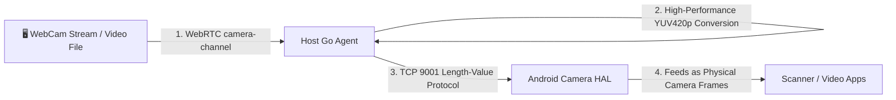

# Virtual HAL Injection (Camera / GPS / Sensors)

In cloud environments (such as Docker `redroid` containers, virtual machines, or custom ROMs), the lack of physical hardware peripherals—such as cameras, GPS chipsets, and gyroscopes—causes barcode scanners, face recognition, map navigation, and tilt-based games to fail.  
The ScrcpyOverWebRTC Agent integrates **Android HAL (Hardware Abstraction Layer) injection protocols** to overcome these limitations.

---

## 📸 1. Camera HAL Virtual Camera Injection (TCP 9001)

### 1. Underlying Pipeline


1. **Capture & Compression**: The web console captures your local webcam via `getUserMedia` (or reads a local video file), encodes frames at 30 FPS, and transmits them over the WebRTC `camera-channel`;
2. **High-Performance YUV Processing**: The Agent executes zero-copy conversions (`image.YCbCr` memory passthrough or YUV420p transcoding) with smart frame-dropping safeguards to eliminate backpressure lag;
3. **HAL Driver Delivery**: Transmits raw YUV frames over TCP port `9001` (customizable via `-camera-addr`) to the Android Camera HAL daemon.

### 2. Usage
In the direct control sidebar under **"Advanced"**, toggle on **"Camera Injection"** and grant browser webcam permissions. The virtual camera inside the cloud phone immediately streams your desktop webcam.

---

## 🗺️ 2. GPS HAL Virtual Location Injection (TCP 9002)

### 1. Mechanism & Anti-Detection
- **Flaws of Standard Mock Location**: Calling Android's `setTestProviderLocation` is easily flagged by anti-fraud SDKs (e.g. food delivery, ride hailing, banking apps) as a "mock provider", risking account bans.
- **Hardware-Level HAL Advantages**:
  - The Agent receives latitude/longitude coordinates via TCP port `9002`;
  - The GPS HAL writes coordinates directly into the hardware configuration file `/data/vendor/gps/gnss`;
  - The GNSS HAL daemon samples this file and feeds data straight into `LocationManagerService`. Apps read this as **genuine hardware GPS telemetry**, bypassing mock-location detection entirely.

### 2. Usage
Click **"Virtual Location"** in the sidebar, search for a point of interest or type coordinates, and click **"Sync Location"**.

---

## 🧭 3. Sensors HAL Simulation (TCP 9003)

### 1. Injection Pipeline
- The Agent listens on TCP port `9003`;
- The frontend captures physical accelerometer and gyroscope data (via browser `DeviceOrientationEvent`) and transmits payloads in standard JSON:
  ```json
  {"type": "sensor", "accelX": 0.1, "accelY": 9.8, "accelZ": 0.2, "gyroX": 0.01, "gyroY": 0.02, "gyroZ": 0.0}
  ```
- The Sensors HAL parses payloads and invokes Android `SensorManager` callbacks, delivering accurate tilt, shake, and motion simulation.
