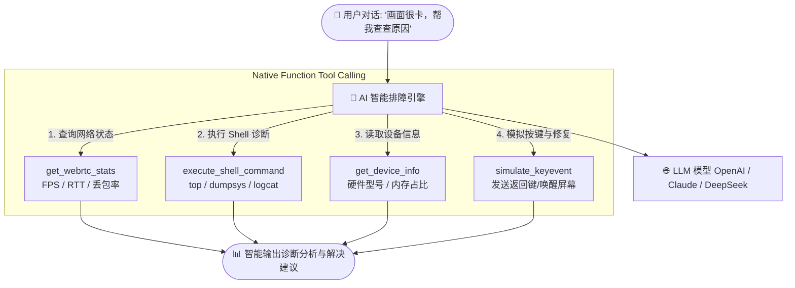

# AI 智能排障诊断助手 (AI Agent Assistant)

ScrcpyOverWebRTC 在 Web 直控面板中深度集成了 **AI 智能排障与诊断助手**。  
助手能够通过自然语言对话，自主调用系统底层的 ADB Shell、WebRTC 网络统计、硬件状态采集以及模拟触控按键，全自动化帮您诊断黑屏、卡顿、丢包及应用崩溃等疑难杂症。

---

## 🤖 核心能力与技术架构

### 1. 多大模型提供商无缝兼容
- 支持配置标准的 **OpenAI 官方接口**（如 `gpt-4o`、`gpt-4-turbo`）；
- 支持接入 **Claude** 以及国内兼容 OpenAI API 规范的任意大模型（如 **DeepSeek-V3 / DeepSeek-R1**、通义千问等）。

### 2. 思考轨迹与工具追踪面板 (Trace Logs)
- 顶层配备实时的 **“AI Agent 思考过程与工具调用日志”** 折叠面板；
- 完整展示大模型的 Prompt 解析、逻辑推理步骤、下发工具参数以及底层返回的数据结果，实现 100% 透明可控。

### 3. 自带的 Native 排障工具集
- **`execute_shell_command`**：在云手机底层执行任意诊断指令（如 `top -m 5`、`logcat -d *:E`），读取输出并返回汇总；
- **`get_webrtc_stats`**：实时抓取当前 WebRTC 媒体流的 FPS 帧率、RTT 往返延迟、丢包率与 Jitter Buffer 大小，秒级定位是手机端性能问题还是网络环境问题；
- **`get_device_info`**：自动读取当前设备的型号、Android 系统版本、CPU 架构与可用内存；
- **`simulate_keyevent` & `simulate_touch`**：模拟点击屏幕或发送系统按键（如 HOME、返回、电源），辅助执行自动恢复。

---

## 🛠️ 配置与使用步骤

### 第 1 步：配置大模型 API
1. 在云手机直控面板底部，切换到 **“AI 助手”** 选项卡；
2. 点击右上角的 **“AI 连接参数设置”**；
3. 填入您的配置：
   - **API Base URL**：如 `https://api.deepseek.com/v1` 或 `https://api.openai.com/v1`；
   - **API Key**：填入您的模型秘钥；
   - **Model Name**：如 `deepseek-chat` 或 `gpt-4o`；
4. 点击保存（参数安全保存在本地浏览器中，不经过任何第三方服务器）。

### 第 2 步：自然语言诊断交互
在对话框中直接输入您的运维诉求，例如：
- *“帮我查一下这台机器上当前 CPU 占用最高的前 3 个进程”*
- *“画面感觉有延迟，帮我分析下当前的丢包率和 RTT 延迟”*
- *“查看一下当前前台正在运行什么 App，并帮我截取最近 10 行错误日志”*

AI 助手将自动执行工具调用并在界面上呈现详细的诊断报告与解决建议。
