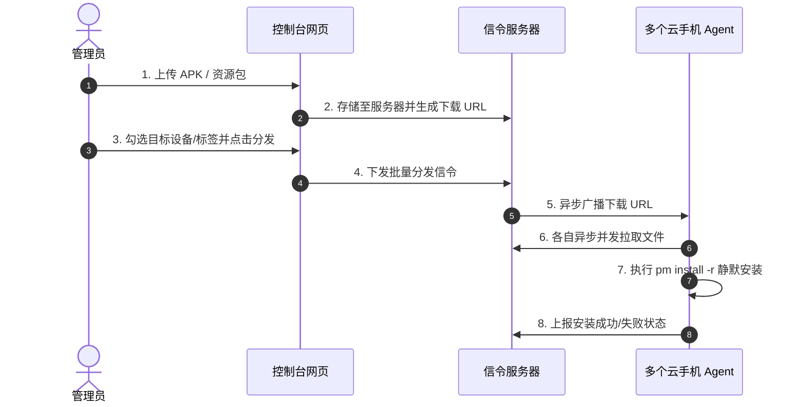

# P2P 文件管理与 APK 批量分发 (File Manager & APK Deploy)

ScrcpyOverWebRTC 内置了基于 WebRTC DataChannel 的 **P2P 文件管理器** 与 **APK 批量静默分发系统**，无需在本地电脑配置任何 ADB 或额外开通 FTP/SSH 端口即可实现高速文件传输与应用部署。

---

## 📁 一、P2P 网页端文件管理器 (`file-channel`)

### 1. 技术原理与传输优化
- **专用二进制 DataChannel**：在 WebRTC 握手时建立独立的 `file-channel` 对等数据通道，与视频流和控制指令完全隔离；
- **滑动窗口与拥塞流控 (BWE)**：内置二进制分块拆包算法与自适应流量控制，即使传输数百兆乃至数 GB 的大文件也不会挤爆网络缓冲区或造成视频卡顿；
- **纯原生 Web 握手**：直接由浏览器前端与 Android 端的 Agent 交互，实现对设备 `/sdcard/` 目录树的完整读取与修改。

### 2. 功能与操作
在设备直控面板的右侧选项卡选择 **“文件管理”**：
- **目录树浏览**：层级浏览 Android 设备的文件与文件夹结构；
- **文件操作**：支持新建文件夹、重命名文件、删除文件；
- **双向极速传输**：
  - **上传**：直接点击“上传文件”或从电脑桌面将文件拖拽入列表；
  - **下载**：点击任意文件右侧的“下载”图标直接保存到本地电脑；
  - **拖拽安装 APK**：将 `.apk` 安装包直接拖入控制视窗或文件管理器，Agent 会在后台自动调用 `pm install -r` 完成安装。

---

## 📦 二、APK 与大文件批量分发 (Bulk Distribution)

针对需要同时给数十台或上百台云手机统一更新应用或下发测试资源包的场景：

### 1. 分发工作流

### 2. 核心优势
- **极度轻量快速**：信令服务器仅广播极简的元数据与下载链接；
- **异步静默安装**：各设备 Agent 启动独立协程在后台异步下载，下载完成后静默完成安装，完全不阻塞当前正在进行的投屏与操控操作。
