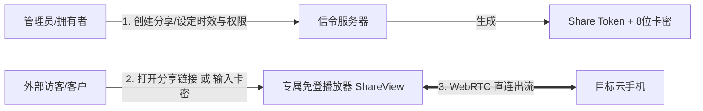

# 机器分享与卡密免登录直连 (Machine Sharing & Card Key)

ScrcpyOverWebRTC 支持将任意云手机快速生成为 **带有效期的分享链接** 或 **8 位简易卡密 (`CP-XXXX-XXXX`)**。  
外部访客或客户无需注册或登录账号，即可直接在浏览器或 Android App 中免登录接入并操控设备，非常适合**远程协助、客户演示、设备短期租赁以及自动化交付**。

---

## 🔑 核心特性与安全机制

1. **双通道免登凭据**：
   - **分享 URL 链接**：带 16 字节 Hex 强随机 Token（如 `https://your-domain:8443/share/st_a1b2c3...`）；
   - **简易卡密提取码**：8 位易读卡密格式（如 `CP-8848-6688`），卡密与 Token 在底层双向索引。
2. **细粒度权限管控**：
   - **全功能控制 (`full`)**：访客拥有完整的触控、按键与剪贴板输入能力；
   - **仅观看模式 (`view_only`)**：双端拦截机制。信令服务器直接丢弃一切触控与按键数据包，前端与 App 同时在界面上禁用输入，彻底防止访客误操作。
3. **PIN 访问密码保护**：
   - 支持设置 4~16 位的自定义访问密码，访客必须输入正确密码方可建立连接。
4. **生命周期与自动踢断 (GC)**：
   - 支持配置有效期（30 分钟、2 小时、1 天、7 天或永久）；
   - 服务端后台定时巡检回收已过期的分享，并在到期瞬间**主动踢断在线访客的 WebRTC 连接**；管理员亦可随时手动“撤销”或“一键续期”。
5. **设备使用中标识**：
   - 当设备有访客正在连接时，管理大盘中的设备卡片会实时覆盖“🟢 使用中”半透明标识，避免其他管理员同时操作引发冲突。

---

## 🛠️ 操作指南

### 1. 生成分享链接与卡密
1. 在设备卡片或设备列表中，点击操作菜单（`···`）选择 **“分享设备 / 卡密”**。
2. 在弹出窗口中配置：
   - **控制权限**：选择「完整控制」或「仅观看」；
   - **有效期**：选择到期时长；
   - **访问密码**：可选填入 PIN 密码；
   - **备注说明**：便于日后识别用途。
3. 点击 **“生成并复制”**，即可将分享链接或卡密发送给客户。

### 2. 访客如何免登录接入

访客可通过以下任意方式瞬间进入设备控制视窗：
- **方式 A (浏览器直接打开)**：点击接收到的分享 URL 链接；
- **方式 B (网页登录页卡密入口)**：打开系统登录页，点击下方的 **“🔑 卡密直连”**，输入 8 位卡密；
- **方式 C (Android App 卡密直连)**：在手机端 App 登录页点击 **“卡密直连”** 填入卡密。

### 3. 独立免登播放器 (`ShareView`) 体验
访客进入专属播放器后，享有专门优化的独立体验：
- 悬浮可拖拽按键栏（电源、HOME、返回、多任务、音量）；
- 独立的画质调节面板（访客调整分辨率与码率不会污染管理员的配置）；
- 顶部清晰显示当前连接状态与剩余有效期倒计时。
