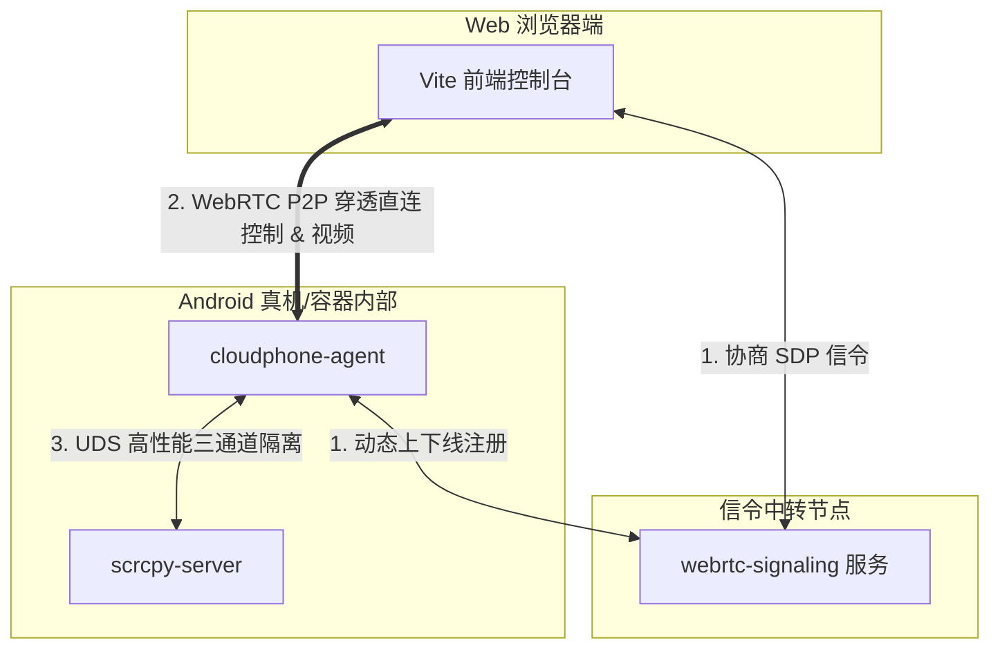

# 项目简介与架构优势

ScrcpyOverWebRTC 是一款面向高频操控、超低延迟场景的**新一代 Web-based 远程 Android 云手机系统**。
系统通过将媒体控制下沉至 Android 内部，省去了繁重的中间服务器转码与转发，实现了极轻量、极速的云手机中心控制台。

---

## ⚡ 架构优势

*   **极致低延迟**：通过直连通道和时钟同步技术，操作手感与画面流畅度达到物理层面的原生表现，消除操作滞后感。
*   **多客户端支持**：前端完全开源。不仅支持各大主流 PC 浏览器、手机浏览器及移动端 App 连接，更方便企业级客户根据具体业务实现深度的功能定制与 UI 改造。
*   **方案适配性强**：不仅能完美适配常规的 Android 物理真机，还对主流的 `redroid` 容器云手机、模拟器以及定制 ROM 具备极佳的兼容性，支持零基础快速上云与批量入网。
*   **卓越的扩展性**：支持与定制 ROM 深度配合，实现远程虚拟摄像头视频流注入、虚拟 GPS 定位模拟、以及陀螺仪/重力等各种物理传感器数据的双向透传模拟。
*   **丰富的商业化功能**：系统开箱即用，内置支持后台静默高频预览大盘、百台设备毫秒级高同步率群控、Shell 网页终端反代、完备的用户与租户权限管理、可视化按键映射编辑器以及动态码率自适应。

---

## 🚀 为什么这么快？

项目能实现极致流畅的瞬时响应，核心依赖于以下四大物理级提速技术：

### 1. 全链路 P2P 极速直连
信令服务器仅在握手初期作为连接交换节点。一旦 SDP 媒体协商完成，浏览器将与 Android 内部的 Agent 直接建立 P2P 通信隧道，**数据传输路径达到物理极限最短**，消除了中间服务器中转带来的路由延迟与带宽挤压。

### 2. 芯片级图形直通
Android 手机画面的采集与处理直接在系统底层完成。画面通过 GPU 与 VPU（MediaCodec 硬件编码器）直接硬件编码输出为视频流，**实现 0 次 CPU 像素拷贝与像素格式转换损耗**，最大化释放设备硬件效能。

### 3. 硬件级时间戳直通
直接透传 Android 底层物理硬件产生的微秒级渲染时间戳（`ptsUs`），并无缝对齐 WebRTC 时钟轴。将浏览器的 Jitter Buffer（防抖动缓冲区）**延迟从秒级直接压缩降至 `<20ms`**，彻底根治了长时间静止画面恢复后的“动作积压”与“画面回跳”现象。

### 4. 物理隔离独立通道
Agent 与手机系统通信使用 Unix Domain Socket 内存级零拷贝通信，并在物理上隔离为独立通道。视频流传输、音频流传输、以及控制与触控指令**各自占用独立 UDS 专用通道**。即使在视频大码率传输高负载状态下，触控动作与按键命令仍能获得实时响应，绝不排队。
