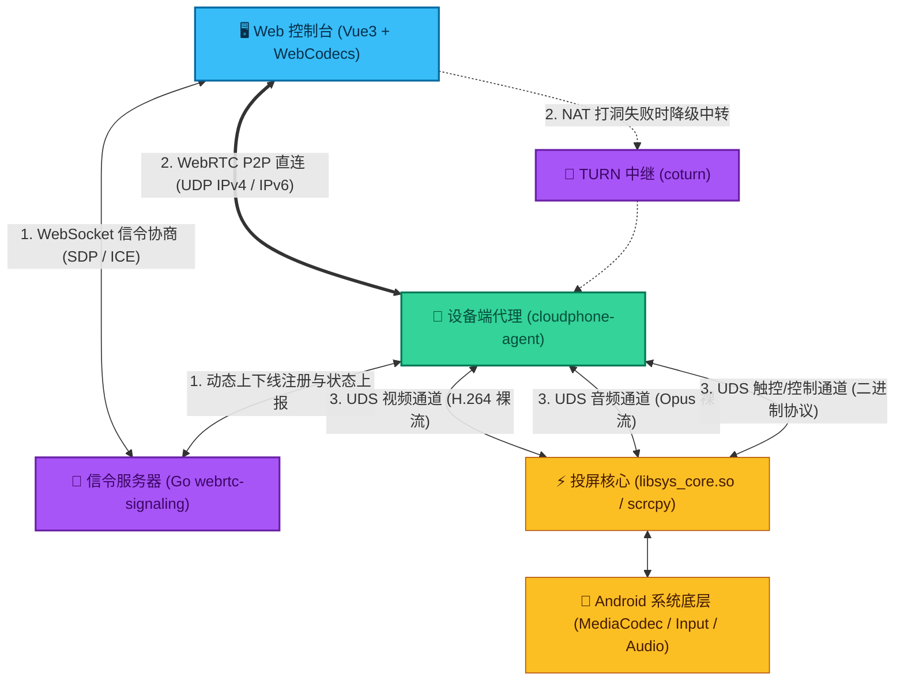

# 项目简介与系统架构

ScrcpyOverWebRTC（穿云投屏）是一款面向超低延迟、高频交互与大规模设备纳管场景的 **Web-based 远程 Android 云手机管理系统**。

系统通过将媒体控制下沉至 Android 设备内部，避免了传统方案中繁重的中心服务器转码与二次转发，实现了极轻量、极高响应速度的设备中心控制台。

```mermaid
graph TD
    classDef client fill:#38bdf8,stroke:#0369a1,stroke-width:2px,color:#082f49;
    classDef server fill:#a855f7,stroke:#6b21a8,stroke-width:2px,color:#3b0764;
    classDef agent fill:#34d399,stroke:#047857,stroke-width:2px,color:#064e3b;
    classDef internal fill:#fbbf24,stroke:#b45309,stroke-width:1px,color:#451a03;

    WebUI["🖥️ Web 控制台 (Vue3 + WebCodecs)"]:::client
    Signaling["📡 信令服务器 (Go webrtc-signaling)"]:::server
    Coturn["🔄 TURN 中继 (coturn)"]:::server
    Agent["🤖 设备端代理 (cloudphone-agent)"]:::agent
    Scrcpy["⚡ 投屏核心 (libsys_core.so / scrcpy)"]:::internal
    AndroidSystem["📱 Android 系统底层 (MediaCodec / Input / Audio)"]:::internal

    WebUI <-->|"1. WebSocket 信令协商 (SDP / ICE)"| Signaling
    Agent <-->|"1. 动态上下线注册与状态上报"| Signaling
    
    WebUI <==>|"2. WebRTC P2P 直连 (UDP IPv4 / IPv6)"| Agent
    WebUI -.->|"2. NAT 打洞失败时降级中转"| Coturn
    Coturn -.-> Agent

    Agent <-->|"3. UDS 视频通道 (H.264 裸流)"| Scrcpy
    Agent <-->|"3. UDS 音频通道 (Opus 裸流)"| Scrcpy
    Agent <-->|"3. UDS 触控/控制通道 (二进制协议)"| Scrcpy
    
    Scrcpy <--> AndroidSystem
```

---

## 🎯 核心设计目标

1. **极致超低延迟**：通过 WebRTC UDP 直连与硬件时间戳（HW-PTS）对齐，操作端到端延迟通常在 **30ms ~ 50ms** 以内，画面与手感高度跟手。
2. **零服务端转码损耗**：信令服务器仅在握手初期负责交换 SDP 与 ICE 候选地址；媒体流直接在浏览器与手机端点对点传输，不消耗服务器 CPU 与 GPU 转码算力。
3. **多终端多形态纳管**：统一纳管物理真机（USB/Wi-Fi/Root/免Root）、Docker `redroid` 容器云手机、模拟器以及定制 ROM。
4. **全功能开箱即用**：内置大盘高频预览、独立预览直控、按键映射、100% 汉字落屏输入法、P2P 文件管理、WebADB 调试、多用户租户与审计日志。

---

## 🔬 关键技术原理

### 1. 全链路 WebRTC P2P 直连与智能降级
- **优先 P2P 直连**：优先使用 UDP 建立直接点对点传输通道；支持 IPv6 原生直连，在双方具备公网 IPv6 地址时可实现零中转流量成本直连。
- **TURN 中继保底**：当处于严格对称型 NAT（Symmetric NAT）或受限企业防火墙等无法直连的环境时，系统自动降级通过内置的 `coturn` 服务器进行流量中继，保障 100% 连接成功率。

### 2. 硬件级 PTS 时间戳直通 (HW-PTS Passthrough)
- 传统远程投屏方案常因静态画面帧率降低导致接收端 Jitter Buffer（抗抖动缓冲区）膨胀，再次触控时出现短暂卡顿或画面快进。
- 本系统在 `scrcpy-server` 编码层捕获 Android 硬件编码器（MediaCodec）输出的微秒级物理渲染时间戳（`ptsUs`），直接透传至 WebRTC RTP 包头，并配合静态画面下的复制帧保活机制，彻底消除首触卡顿与延迟积压。

### 3. Unix Domain Socket (UDS) 三通道物理隔离
- Android 端 `cloudphone-agent` 与 `scrcpy-server` 之间的进程通信使用 Linux 本地套接字（Unix Domain Socket，零网络协议栈拷贝）。
- 通信链路在物理上划分为独立的三大通道：
  - **视频通道 (Video UDS)**：传输纯净 H.264 Annex B 裸流；
  - **音频通道 (Audio UDS)**：传输 Opus 编码音频流；
  - **控制与触控通道 (Control UDS)**：传输高优先级触控事件与设备控制指令。
- **优势**：即使在视频大码率瞬时拥塞的高负载状态下，触控指令仍通过独立的控制通道瞬间送达并执行，杜绝操作指令排队等待。

### 4. 视口感知高频预览与 WebCodecs GPU 硬解
- 大盘监控页抛弃了传统 CPU 压缩 JPEG 图片的低效方案，直接采用低分辨率 H.264 视频裸流分发。
- 浏览器利用现代 **WebCodecs API (`VideoDecoder`)** 直接调用本地 GPU 进行硬件解码，渲染到 `<canvas>` 画布上，内存与 CPU 开销大幅降低。
- 结合 `IntersectionObserver` 视口监听：仅对滚动到屏幕可见区域内的设备激活高频预览（5~10 FPS），滚出可视区自动降级，有效支撑数十乃至上百台设备同屏监控。

---

## ➡️ 下一步推荐

- 查看系统完整能力清单：[核心功能全景特性](/features)
- 查看硬件要求与部署路线：[硬件要求与选型决策](/quickstart)
- 开始接入第一台设备：[设备接入准备](/agent-prep)
