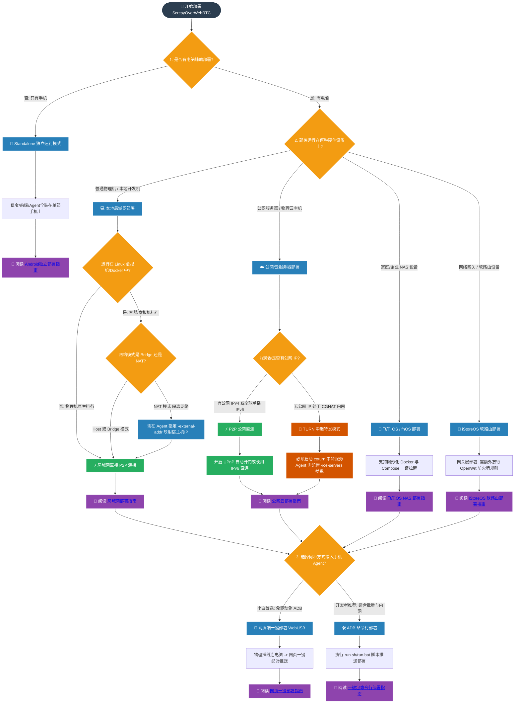

# 🚀 部署与使用快速指引

为了让新手用户和开发者能够快速理清整个 ScrcpyOverWebRTC 项目的部署方向，本页面提供了一套直观的 **部署与接入决策导图**。

---

## 🗺️ 部署与接入选择决策树

```mermaid
graph TD
    Start([🚀 开始部署 ScrcpyOverWebRTC]) --> Dec1{1. 是否有电脑辅助部署?}
    
    %% 无电脑路线
    Dec1 -->|否: 只有手机| Standalone[📱 Standalone 独立运行模式]
    Standalone --> Standalone_Desc[信令/前端/Agent全装在单部手机上]
    Standalone_Desc --> Link_Standalone[📄 阅读 <a href='/docs/deploy-standalone'>Android独立部署指南</a>]
    
    %% 有电脑路线
    Dec1 -->|是: 有电脑| Dec2{2. 部署运行在何种硬件设备上?}
    
    %% 局域网/私有云路线
    Dec2 -->|家庭/企业 NAS 设备| FNOS[🐋 飞牛 OS / fnOS 部署]
    FNOS --> FNOS_Desc[支持图形化 Docker 与 Compose 一键拉起]
    FNOS_Desc --> Link_FNOS[📄 阅读 <a href='/docs/deploy-fnos'>飞牛OS NAS 部署指南</a>]
    
    Dec2 -->|网络网关 / 软路由设备| ISTOREOS[📶 iStoreOS 软路由部署]
    ISTOREOS --> ISTOREOS_Desc[网关层部署, 需额外放行 OpenWrt 防火墙规则]
    ISTOREOS_Desc --> Link_ISTOREOS[📄 阅读 <a href='/docs/deploy-istoreos'>iStoreOS 软路由部署指南</a>]
    
    Dec2 -->|普通物理机 / 本地开发机| LAN[💻 本地局域网部署]
    LAN --> Dec_LAN_Env{运行在 Linux 虚拟机/Docker 中?}
    
    Dec_LAN_Env -->|否: 物理机原生运行| LAN_Direct[⚡ 局域网直接 P2P 连接]
    Dec_LAN_Env -->|是: 容器/虚拟机运行| Dec_Docker_Net{网络模式是 Bridge 还是 NAT?}
    
    Dec_Docker_Net -->|Host 或 Bridge 模式| LAN_Direct
    Dec_Docker_Net -->|NAT 模式 隔离网络| LAN_NAT_Config[需在 Agent 指定 -external-addr 映射宿主机IP]
    LAN_NAT_Config --> LAN_Direct
    
    LAN_Direct --> Link_LAN[📄 阅读 <a href='/docs/deploy-lan'>局域网部署指南</a>]
    
    %% 跨网段/公网路线
    Dec2 -->|公网服务器 / 物理云主机| WAN[☁️ 公网/云服务器部署]
    WAN --> Dec_WAN_IP{服务器是否有公网 IP?}
    
    Dec_WAN_IP -->|有公网 IPv4 或全球单播 IPv6| WAN_P2P[⚡ P2P 公网直连]
    WAN_P2P --> WAN_P2P_Config[开启 UPnP 自动开门或使用 IPv6 直连]
    WAN_P2P_Config --> Link_WAN[📄 阅读 <a href='/docs/deploy-cloud'>公网云部署指南</a>]
    
    Dec_WAN_IP -->|无公网 IP 处于 CGNAT 内网| WAN_TURN[🔄 TURN 中继转发模式]
    WAN_TURN --> WAN_TURN_Config[必须启动 coturn 中转服务<br/>Agent 需配置 -ice-servers 参数]
    WAN_TURN_Config --> Link_WAN
    
    %% 统一设备接入方式决策
    Link_LAN & Link_WAN & Link_FNOS & Link_ISTOREOS --> Dec_Device_Join{3. 选择何种方式接入手机 Agent?}
    
    Dec_Device_Join -->|小白首选: 免驱动免 ADB| WebUSB[🔌 网页端一键部署 WebUSB]
    WebUSB --> WebUSB_Desc[物理插线连电脑 -> 网页一键配对推送]
    WebUSB_Desc --> Link_WebUSB[📄 阅读 <a href='/docs/agent-deploy'>网页一键部署指南</a>]
    
    Dec_Device_Join -->|开发者推荐: 适合批量与内网| ADB_Cmd[🛠️ ADB 命令行部署]
    ADB_Cmd --> ADB_Cmd_Desc[执行 run.sh/run.bat 脚本推送部署]
    ADB_Cmd_Desc --> Link_ADB[📄 阅读 <a href='/docs/agent-deploy'>一键包命令行部署指南</a>]

    %% 样式定制
    classDef start fill:#2c3e50,stroke:#fff,stroke-width:2px,color:#fff;
    classDef choice fill:#f39c12,stroke:#fff,stroke-width:2px,color:#fff;
    classDef node_green fill:#27ae60,stroke:#fff,stroke-width:2px,color:#fff;
    classDef node_orange fill:#d35400,stroke:#fff,stroke-width:2px,color:#fff;
    classDef node_blue fill:#2980b9,stroke:#fff,stroke-width:2px,color:#fff;
    classDef doc_link fill:#8e44ad,stroke:#fff,stroke-width:1px,color:#fff;
    
    class Start start;
    class Dec1,Dec2,Dec_LAN_Env,Dec_Docker_Net,Dec_WAN_IP,Dec_Device_Join choice;
    class LAN_Direct,WAN_P2P,WAN_P2P_Config node_green;
    class WAN_TURN,WAN_TURN_Config node_orange;
    class Standalone,LAN,WAN,WebUSB,ADB_Cmd,LAN_NAT_Config,FNOS,ISTOREOS node_blue;
    class Link_Standalone,Link_LAN,Link_WAN,Link_WebUSB,Link_ADB,Link_FNOS,Link_ISTOREOS doc_link;
```
