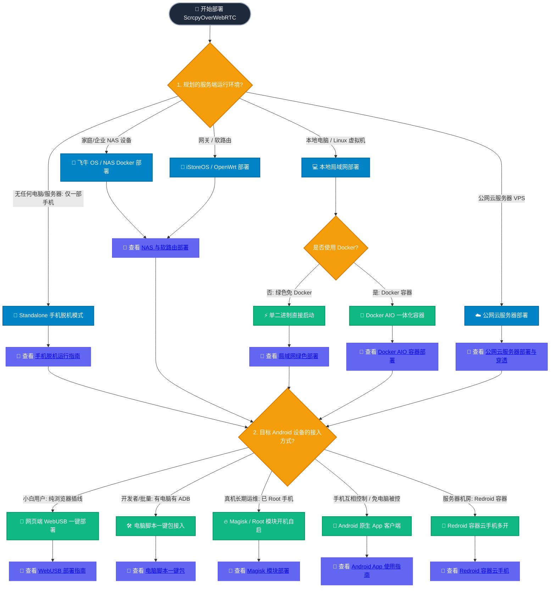

# 硬件要求与选型决策 (Quickstart & Sizing)

在部署 ScrcpyOverWebRTC 之前，请阅读本页面了解基础硬件配置要求，并根据您的实际业务场景选择最合适的部署路线。

> [!IMPORTANT]
> **概念澄清：本系统是「云手机集中控制与管理平台」，而不是「Android 虚拟机生成系统」本身。**  
> 本系统负责将您现有的 Android 物理真机、本地安卓模拟器、redroid 容器或第三方云手机统一接入管理大盘，提供毫秒级超低延迟的 Web 远程操控与批量运维。

---

## 💻 基础硬件与环境要求

系统分为 **控制管理服务端** 与 **待接入设备端** 两个核心角色：

### 1. 控制管理服务端 (Signaling & Web)

服务端负责信令协商、设备状态维护与 Web 控制台托管，不参与音视频流的转码与二次转发，因此**硬件要求极低**：

| 部署形态 | 最低配置 | 推荐配置 | 适用场景 |
| :--- | :--- | :--- | :--- |
| **局域网 NAS / PC** | 1 核 CPU / 1GB 内存 | 2 核 CPU / 2GB 内存 | 飞牛 fnOS、群晖、iStoreOS 软路由、Windows / Mac 局域网开发机 |
| **公网云服务器 (VPS)** | 1 核 CPU / 1GB 内存 / 1Mbps 带宽 | 2 核 CPU / 2GB 内存 / 3Mbps 带宽 | 阿里云/腾讯云（2c2g3M 实测可纳管 100 台设备巡检，支持 2~4 人低码率并发控制） |
| **脱机单机模式 (Standalone)** | 运行于 Android 手机内部 | Android 11+ / 4GB 内存 | 无电脑、无服务器，一部手机内部自给自足运行 |

### 2. 待接入设备端 (Agent & Target Device)

待接入的目标 Android 设备负责采集屏幕画面并通过硬件编码输出：

| 设备类型 | 系统与权限要求 | 部署方式 |
| :--- | :--- | :--- |
| **物理真机 (已 Root)** | Android 7.0+ (推荐 Android 10+)，已安装 Magisk / KernelSU / APatch | [Magisk 模块开机自启](/agent-magisk) 或 [一键脚本](/agent-script) |
| **物理真机 (免 Root)** | Android 7.0+，已开启 USB 调试与安全设置 | [WebUSB 网页一键部署](/agent-webusb)、[电脑一键脚本](/agent-script) 或 [Android App (Shizuku模式)](/app-guide) |
| **Docker Redroid 容器** | 宿主机支持 KVM，Android 11 / 12 镜像 | [容器端口映射与多开](/agent-docker) |
| **Android 模拟器** | 支持雷电、MuMu、逍遥等主流模拟器 | [电脑脚本一键包接入](/agent-script) |

---

## 🗺️ 部署与选型决策导图

通过以下决策流程，快速定位适合您的部署组合：



---

## ⚡ 极速起步 3 步走

如果您是初次体验，推荐按以下 3 步快速跑通：

1. **第 1 步：启动服务端**
   - 快速体验首选 **Docker 一体化镜像 (AIO)**：
     ```bash
     docker run -d --name cp-aio --net=host -v ./data:/app/data -e PUBLIC_IP=<您的IP> buutuu/scrcpy-over-webrtc:latest
     ```
   - 或使用免 Docker 绿色包：解压后执行 `./start_server.sh`。
2. **第 2 步：打开 Web 控制大盘**
   - 在浏览器中访问 `https://<服务器IP>:8443`，默认管理员账号 `admin` / 密码 `admin123`。
3. **第 3 步：接入您的第一台 Android 设备**
   - 使用 USB 数据线连接手机与电脑，在 Web 仪表盘点击 **“部署新设备”** -> **“连接并授权设备”**，按提示一键完成 Agent 推送与自启。

---

## ➡️ 下一步推荐

- 开始第一台设备的接入配置：[设备接入准备与开发者选项](/agent-prep)
- 查看服务端的统一参数配置：[服务端统一配置与端口参数](/deploy-config)
