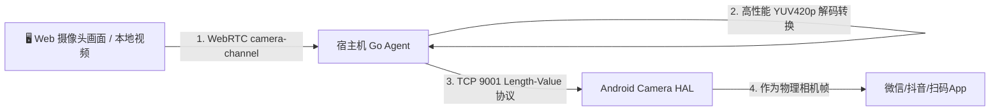

# 虚拟 HAL 注入方案 (Camera / GPS / Sensors)

在云手机（如 Docker `redroid` 容器、虚拟机或定制 ROM）中，由于缺乏物理摄像头、GPS 芯片或陀螺仪等物理外设，当运行扫码、人脸识别、高德/美团地图定位或重力感应游戏时，常因无法读取传感器而异常。  
ScrcpyOverWebRTC Agent 深度适配了基于 **Android HAL（硬件抽象层）的底层数据注入协议**。

---

## 📸 一、Camera HAL 虚拟摄像头注入 (TCP 9001)

### 1. 技术工作原理


1. **视频流采集与压缩**：Web 控制台通过浏览器 `getUserMedia` 抓取本机摄像头，或读取本地图片/视频，以 30 FPS 压缩后经 WebRTC DataChannel 的 `camera-channel` 发送；
2. **高性能 YUV 解码**：Agent 接收后进行高性能内存转换（若为 `image.YCbCr` 直接内存拷贝，其他格式转为 YUV420p），具备智能丢帧防积压保护；
3. **HAL 驱动注入**：Agent 通过 TCP 端口 `9001`（可通过 `-camera-addr` 参数自定义）将 YUV 帧发送给 Android Camera HAL 接收端，供系统相机 App 消费。

### 2. 使用方法
在设备直控面板的 **“高级”** 选项卡中，开启 **“摄像头注入”**，允许浏览器摄像头权限后，云手机内的相机应用即可实时呈现您电脑摄像头的画面。

---

## 🗺️ 二、GPS HAL 虚拟定位注入 (TCP 9002)

### 1. 注入机制与防封禁优势
- **传统 Mock 方案缺陷**：调用 Android 的 `setTestProviderLocation` 极易被美团、高德、微信等安全组件检测到开启了“模拟位置”而遭到风控或封号。
- **底层 HAL 注入优势**：
  - Agent 在 TCP 端口 `9002` 监听经纬度坐标数据；
  - GPS HAL 接收到新坐标后，动态更新底层 `/data/vendor/gps/gnss` 硬件配置文件；
  - 定位 HAL 采样线程每秒读取该文件并直接上报给系统的 `LocationManagerService`，APP 层面读取到的是**完全真实的硬件 GPS 数据**，彻底避开系统级模拟定位检测。

### 2. 使用方法
在直控面板右侧点击 **“虚拟定位”**，在搜索框中搜索地点或输入经纬度，点击 **“同步位置”** 即可瞬间生效。

---

## 🧭 三、Sensors HAL 物理传感器模拟 (TCP 9003)

### 1. 注入机制
- Agent 开放 TCP 监听端口 `9003`；
- 前端捕获电脑或手机物理陀螺仪/加速度数据（Web 端通过 `DeviceOrientationEvent`），以标准 JSON 格式发送：
  ```json
  {"type": "sensor", "accelX": 0.1, "accelY": 9.8, "accelZ": 0.2, "gyroX": 0.01, "gyroY": 0.02, "gyroZ": 0.0}
  ```
- Sensors HAL 解析后动态更新全局变量，并在传感器采样回调中实时上报给 Android 系统的 `SensorManager`，实现精准的重力和运动模拟。
